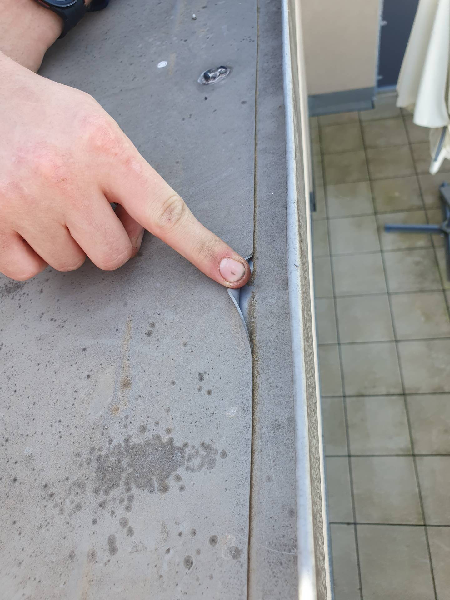
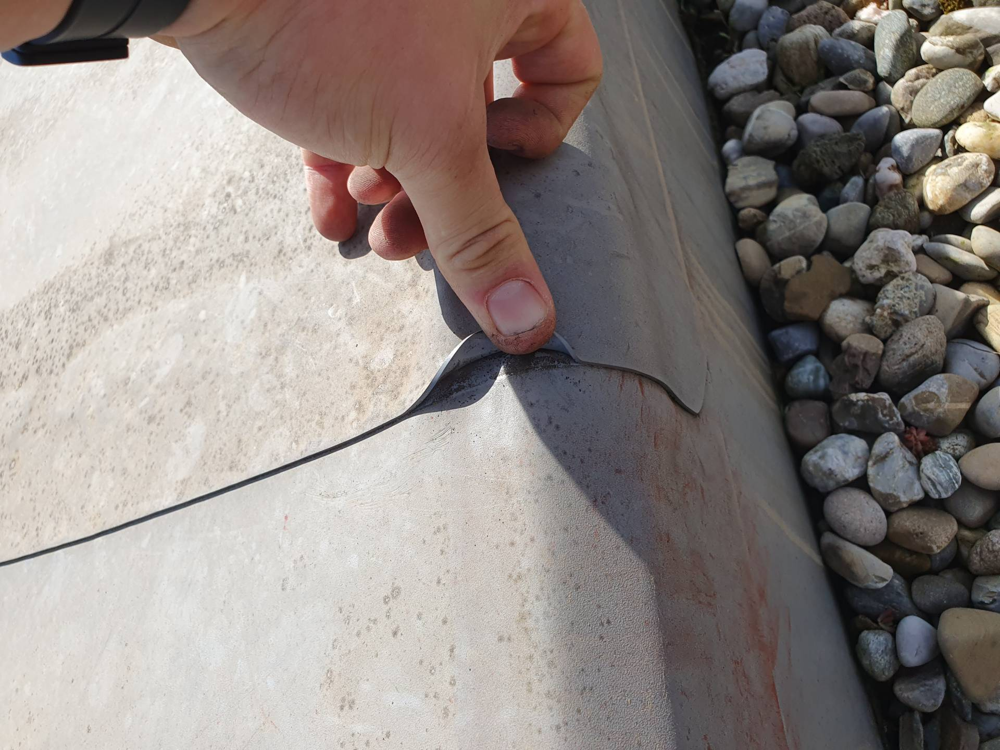
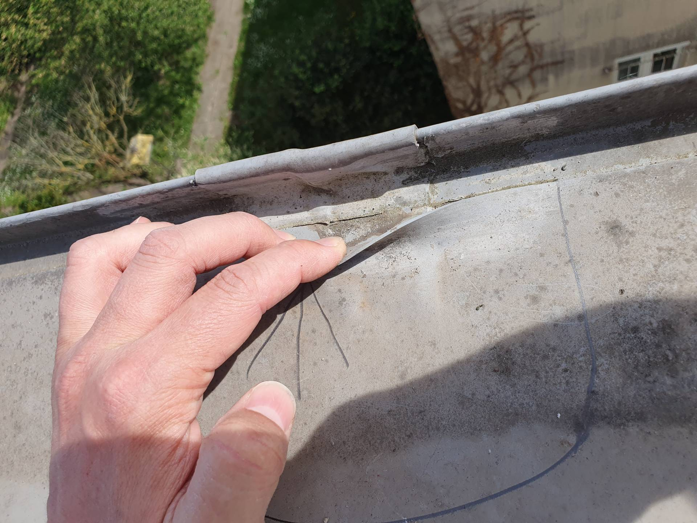

# A6 &ndash; Folienabdichtung auf Attika löst sich an zahlreichen Stellen bei allen Häusern

_[&lt; zurück](../index.md)_

Bauträger Vorgangsnummer: 8424-0391



Bei der Dachwartung wurde festgestellt, dass sich die Folienabdichtung auf der Attika bei beiden Häuserreihen an vielen Stellen löst.

Desweiteren sollte geklärt werden, ob die Ausführung in der Form zulässig ist. Die Folie ist ohne weiteren Schutz direkt auf die Attikaverkleidung geschweißt.

## Fotos

