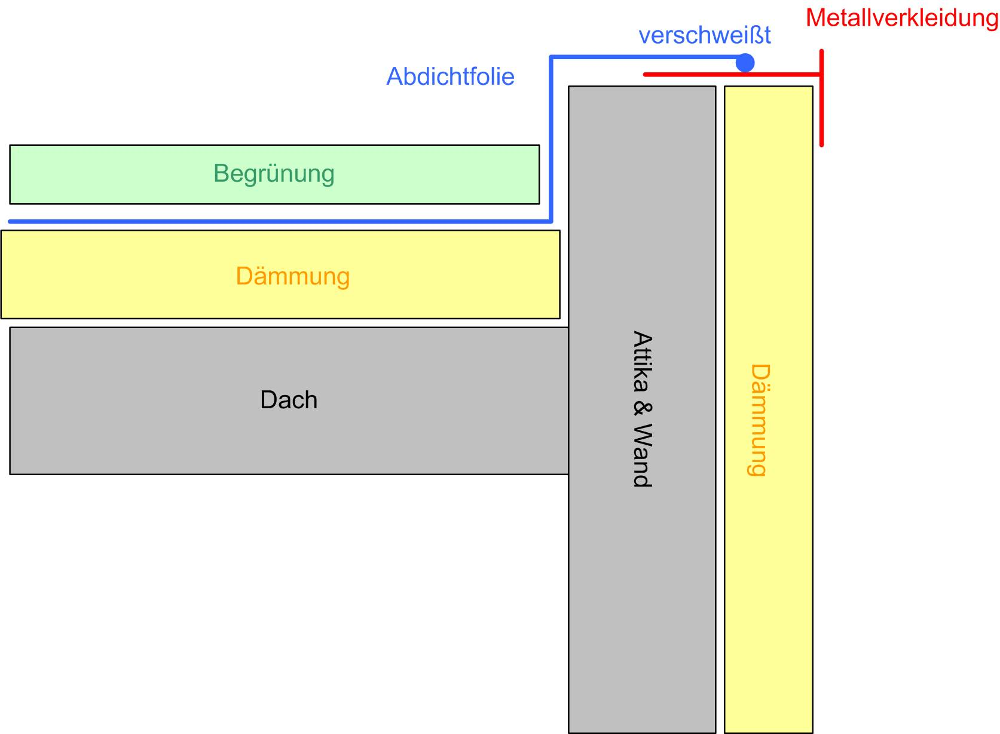
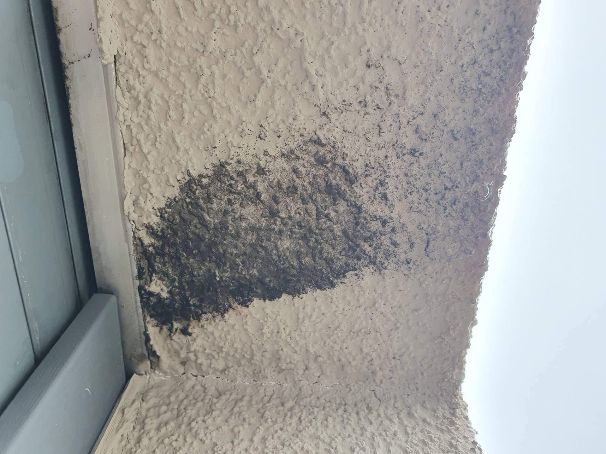
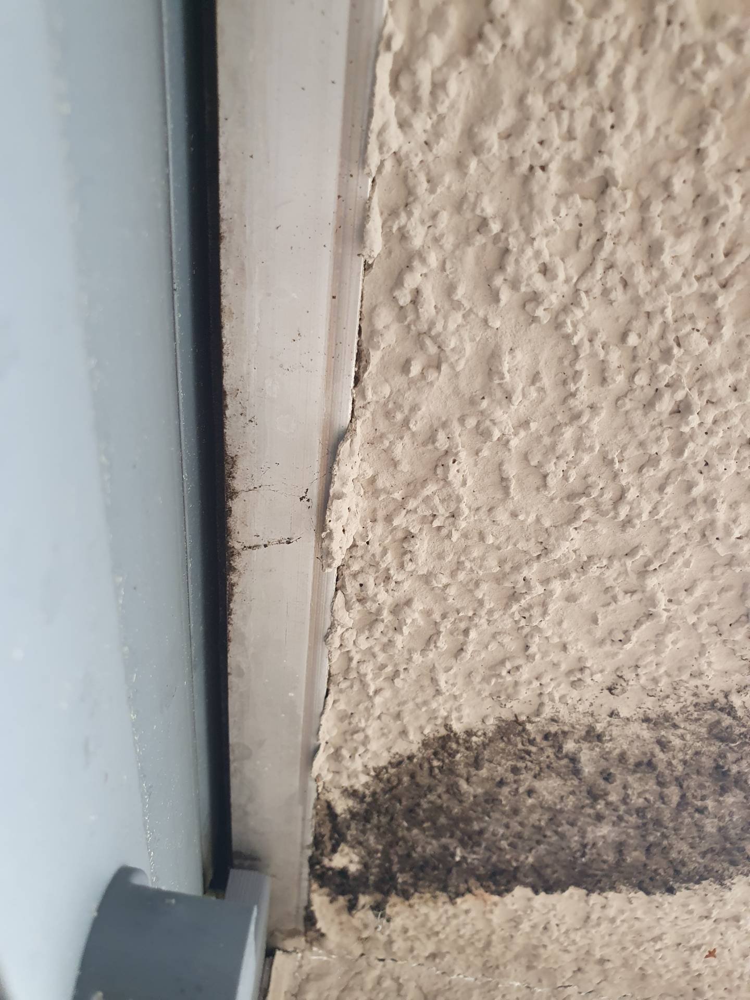

# 8424-0382 &ndash; Schimmel Fassade Haus 10

_[&lt; zurück](../../index.md)_



Im Bereich des Rollladens zur Dachterrasse sind schwarze Stellen aufgetreten.

Sollte der Grund Wasser hinter der Dämmung sein, hieße dass, das Dach oder die Attika wäre undicht.

_Mutmaßlicher vereinfachter Aufbau Dach Attika und Fassade:_

## Fotos

2024-04-21

2024-04-21

