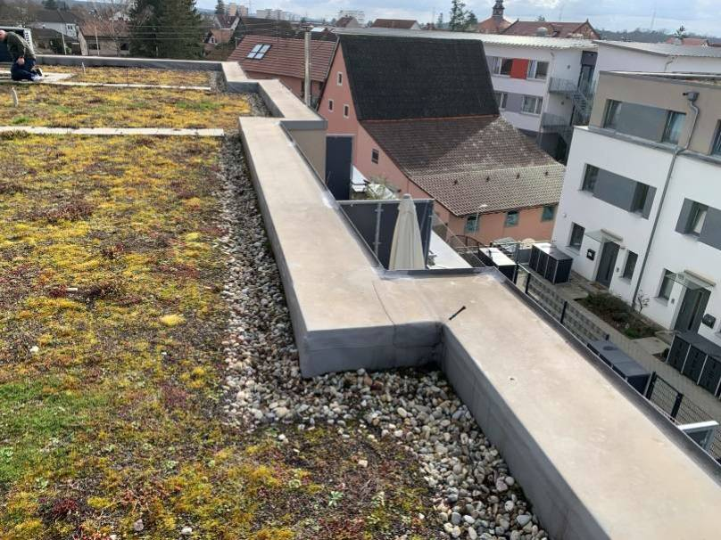
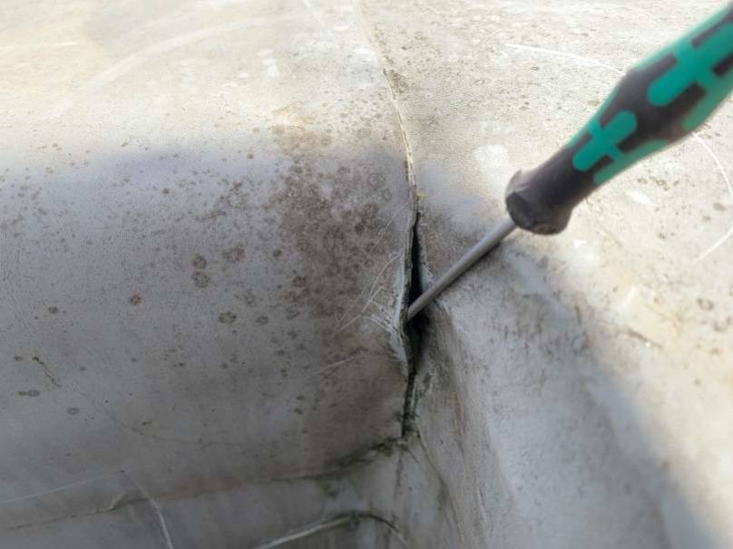
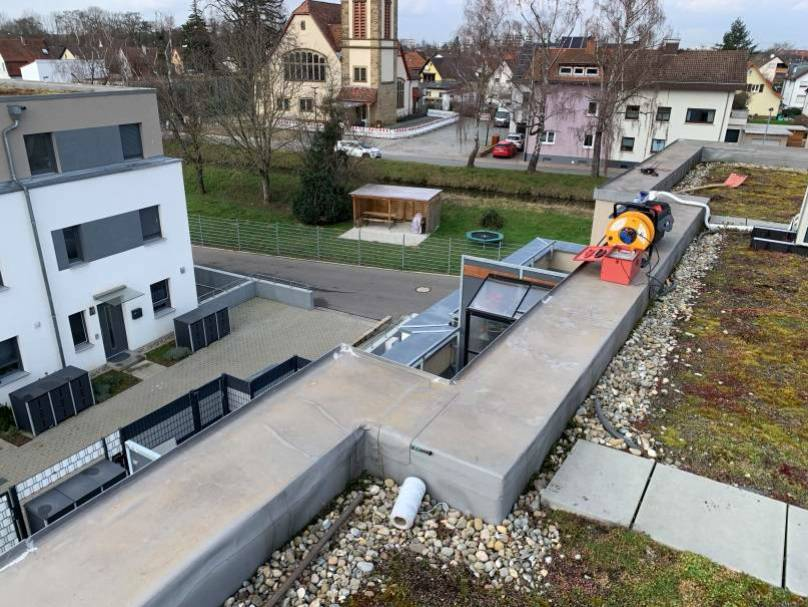
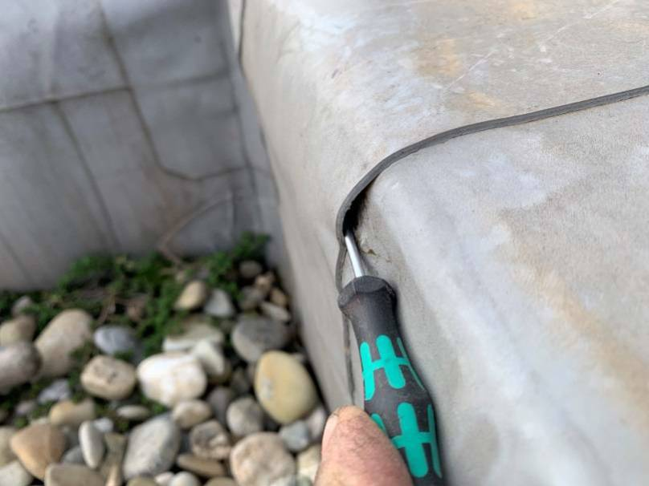

# A15 &ndash; 2 Leckagen Dach, Haus 10

_[&lt; zurück](../../index.md)_



Am 23.02.2023 wurde eine Leckortung bei den Flachdächern beider Häuserreihen
mittels Potenzialausgleichsmessungen durchgeführt.
Hier das zugehörige [Untersuchungsprotokoll] (zugriffsgesichert).

Der Bauträger hat daraufhin die Leckagen abdichten lassen, ohne allerdings
eine Öffnung vornehmen zu lassen, um zu untersuchen, wieviel Wasser eingedrungen ist.
Eine Trocknung der Dämmschicht hat dementsprechend auch nie stattgefunden.

## Fotos

2023-02-23 (aus Leckortungsprotokoll)

2023-02-23 (aus Leckortungsprotokoll)

2023-02-23 (aus Leckortungsprotokoll)

2023-02-23 (aus Leckortungsprotokoll)

2023-02-23 (Haus 10)

[Untersuchungsprotokoll]: https://drive.google.com/drive/folders/1Bhk95p84AaMtnwnOoj_zFdLu95Lqjsnd?usp=drive_link
