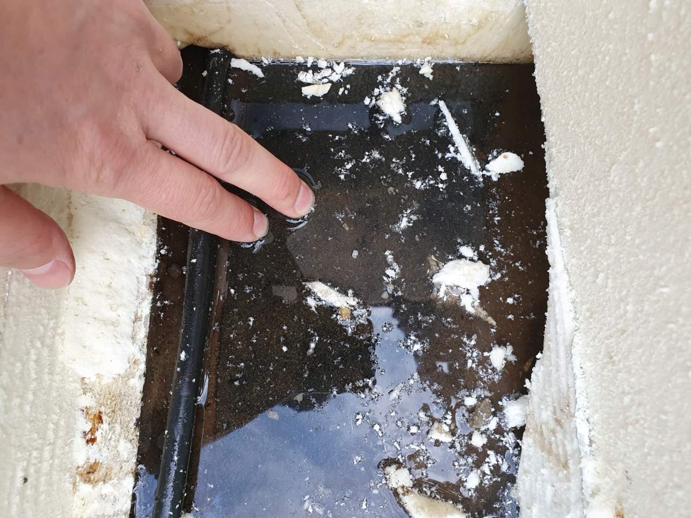
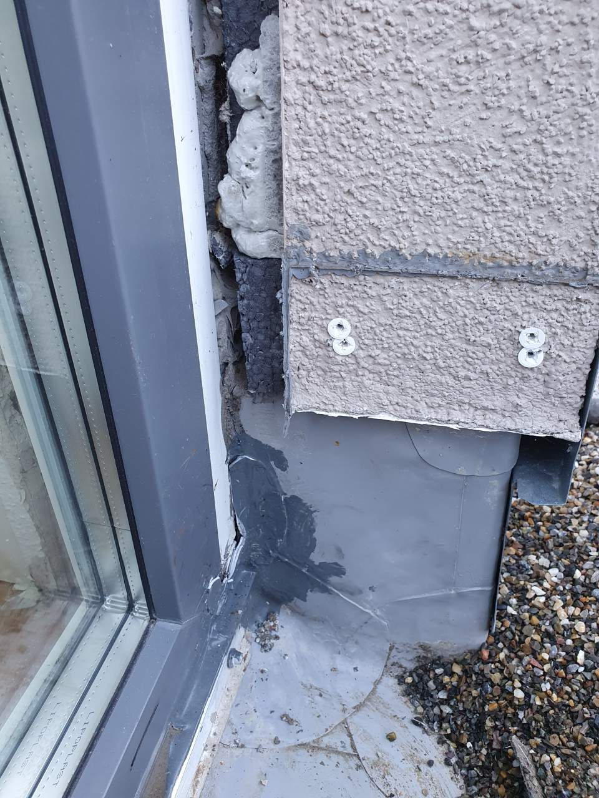
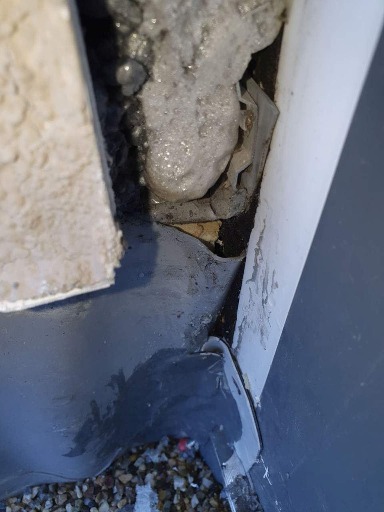
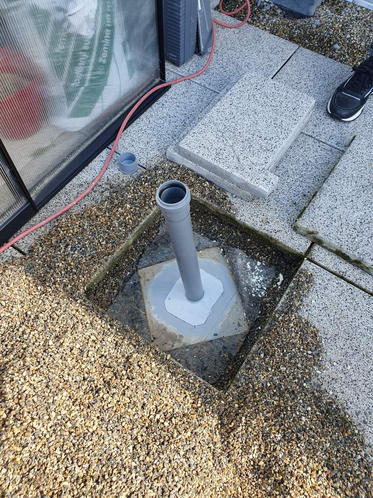
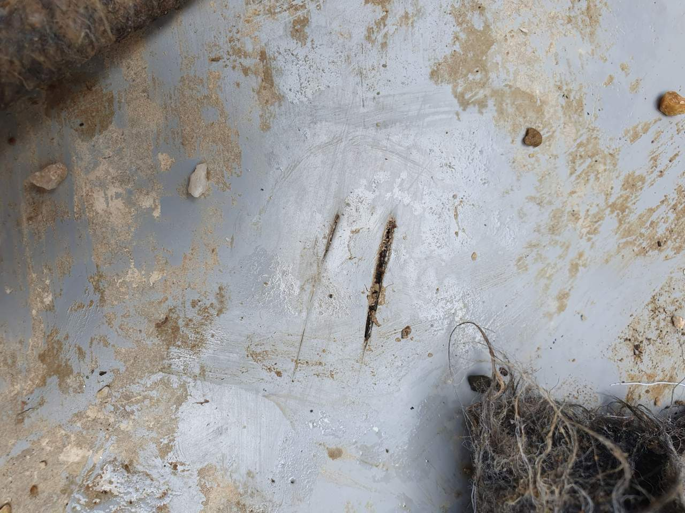
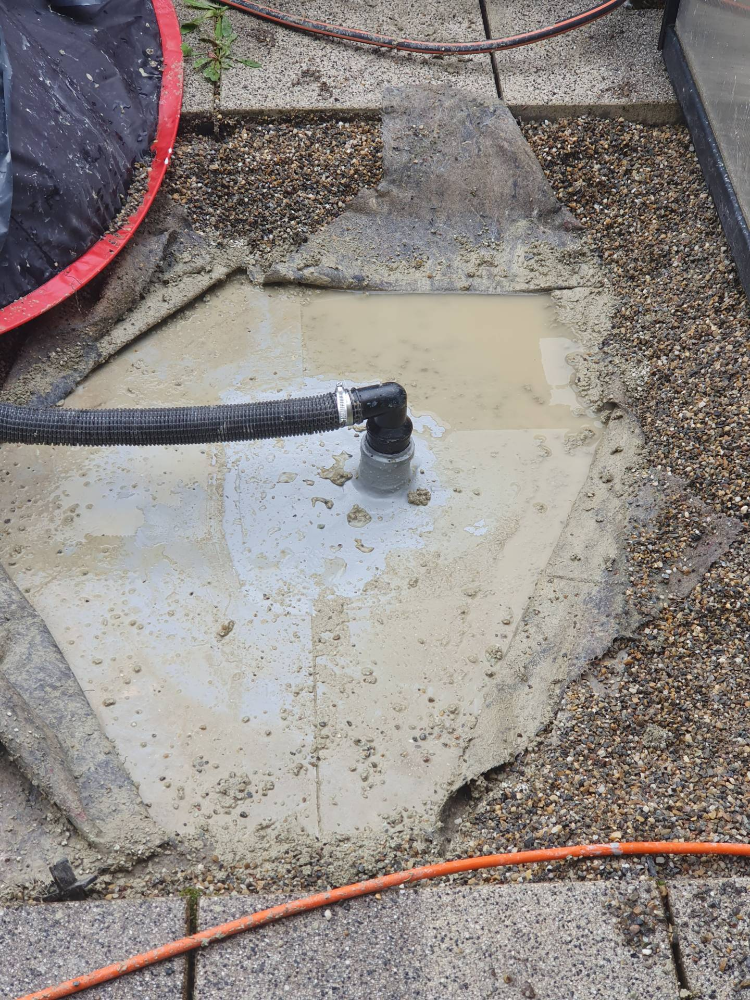
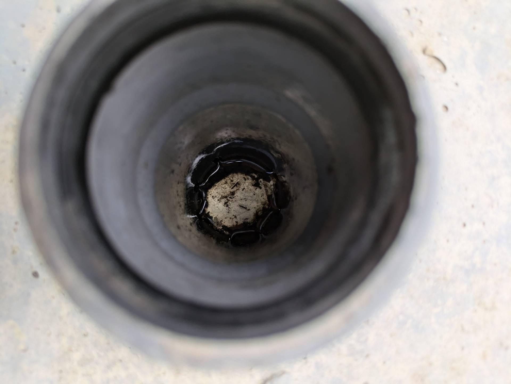

# 8424-0327 &ndash; Wasserschaden Dachterrasse, 2. OG und 1. OG, Haus 9

_[&lt; zurück](../../index.md)_

_Bauträger Vorgangsnummer: 8424-0327_



- [8424-0327 – Wasserschaden Dachterrasse, 2. OG und 1. OG, Haus 9](#8424-0327--wasserschaden-dachterrasse-2-og-und-1-og-haus-9)
  - [Weitere Historie](#weitere-historie)
  - [Fotos](#fotos)

Bei Haus 9 lief 2022 Wasser unter die Folienabdichtung der Dachterrasse und über ein Loch in der Wand (für Stromkabel) ins Haus, auf den Betonboden des 2.OG, bis zum Treppenhaus und hat dort die Trockenbauwände durchnässt.

Aktueller Stand (16.06.2024):
- Innen wurde alles getrocknet und wiederhergestellt.
- Außen wird getrocknet, es tritt allerdings immer noch Wasser in die Dämmschicht ein.

- [_Siehe ähnlicher Wasserschaden bei Haus 2 (A9)_](../A9/index.md)
- [_Siehe ähnlicher Wasserschaden bei Haus 3 (A10)_](../A10/index.md)

## Weitere Historie

Hier die meisten Ereignisse bzgl. der Wasserschadens über die Dachterrasse von Haus 9.
Mails, etc. die nichts am Verlauf geändert haben wurden weggelassen.

| Datum | Ereignis |
| ----- | -------- |
| 19.10.2022 | Meldung Wasserschaden im Flur/Treppenhaus |
| 25.10.2022 | Leckortung: Wasser kommt über Dachterrasse |
| 04.11.2022 | Sachverständigentermin (vom Eigentümer beauftragt) |
| 22.11.2022 | Trockenbauwände innen entfernt |
| 24.02.2022 | Dachdecker: Rollladenleisten gekürzt, Folie abgedichtet (1. Versuch), Folie + Dämmung geöffnet, Wasser festgestellt.
| 28.02.2022 | Rollladenbauer stellt fest: Folie immer noch nicht dicht |
| 03.04.2023 | Dachdecker + Rollladenbauer: Rollladenschienen entfernt, Folie abgedichtet mit Flüssigkunststoff, 2 Kaldomate (HT-Rohre) installiert |
| 04.04.2024 | Trocknungsgeräte Innen und Außen installiert |
| 11.05.2023 | Innen trocken. Außen weiterhin stehendes Wasser! |
| 18.09.2023 | Leckortung mittels Potenzialausgleichsmessungen über die komplette Dachterrassenfläche: 2 Schnitte bei Haus 9, 1 Leckage bei Haus 11 |
| 22.09.2023 | Dachdecker: Abdichtung Leckagen |
| 22.11.2023 | Immer noch 1-2cm stehendes Wasser in Dämmung |
| 13.12.2023 | Innenbereich komplett wiederhergestellt |
| 02.01.2024 | Trocknung abgebaut (wegen Winter), immer noch feucht, Trocknung im Frühjahr empfohlen |
| 04.03.2024 | Trocknungsgeräte außen angeschlossen |
| 08.03.2024 | Stehendes Wasser mehrere Zentimeter hoch. Undichtheit an HT-Rohren entdeckt und abgedichtet. |
| 12.04.2024 | Weitere Leckage an HT-Rohren entdeckt |
| 24.04.2024 | Dachdecker: Komplettabdichtung HT-Rohre |
| 02.05.2024 | War inzwischen trocken. Gießkannentest: Es wird Innen wieder feucht. |
| 09.06.2024 | Zwischenzeitlich trocken, aber nach Regenphase wieder 1cm Wasser, nur im rechten Rohr! |

Es wurden also über die Zeit mehrere Leckagen gefunden:

1. Im Bereich der Rollladenleisten, da diese schon montiert waren, als abgedichtet wurde.
2. Zwei Schnitte in der Folie bei Haus 9 + 1 kleines Loch in der Foliennaht bei Haus 11
3. HT-Rohr nicht ausreichend abgedichtet
4. Folie um HT-Rohr undicht, nicht richtig verschweißt.
5. Es tritt weiterhin Wasser ein... woher?

Desweiteren wurden auf dem Flachdach Leckagen/Mängel gefunden:

1. Zwei Löcher (Ecke Folie unzureichend verschweißt) bei Haus 8.
2. An 24 Stellen löst sich die Folie auf der Attika (bei Dachwartung festgestellt).

## Fotos

