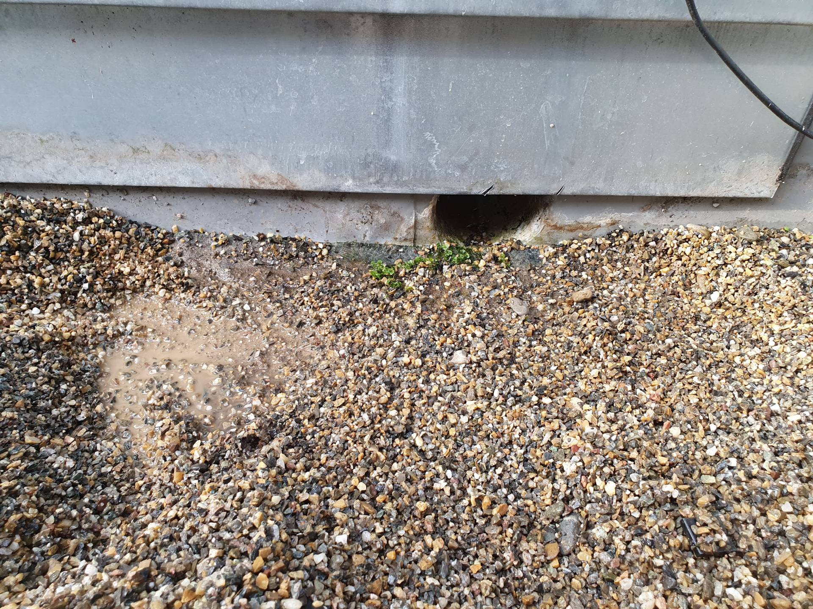
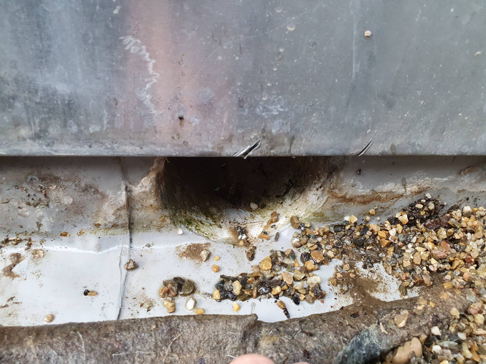

# 8424-0375 &ndash; DG Terrasse Folie tiefer als Abfluss, Haus 9

_[&lt; zurück](../../index.md)_

_Bauträger Vorgangsnummer: 8424-0375_



Es hat den Anschein als wäre die Folienabdichtung (im Bereich des Regenabflusses) tiefer als das Abflussrohr. Dadurch bleibt immer Wasser auf der Folienabdichtung stehen. Es ist zu klären, ob dies so zulässig ist.

## Fotos

2023-11-04

2023-11-04
