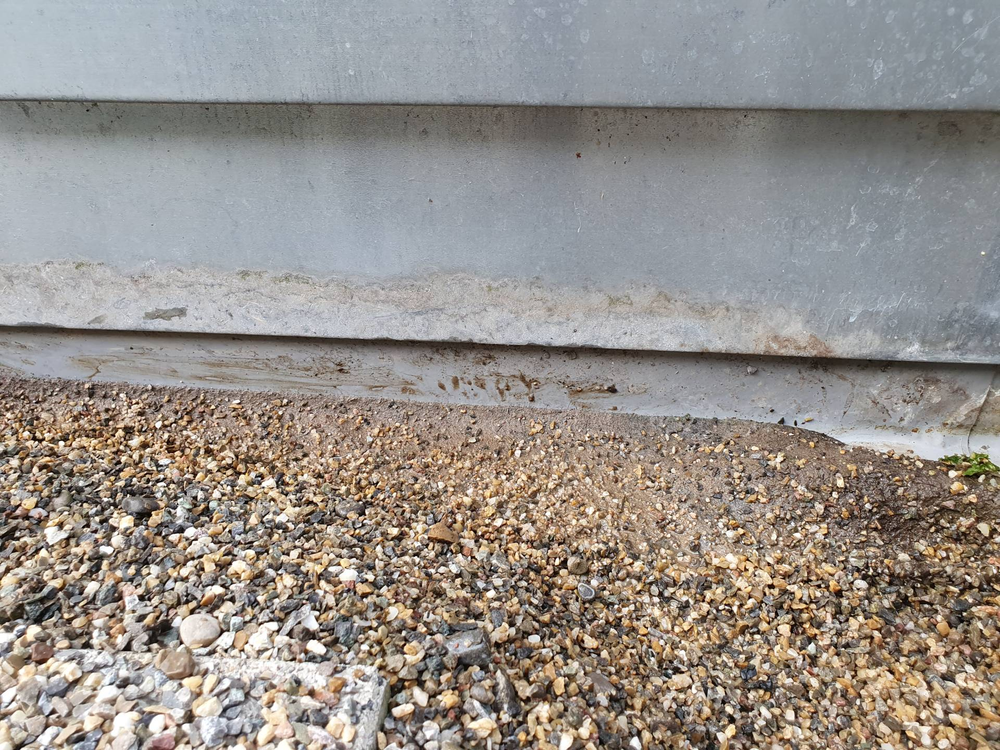
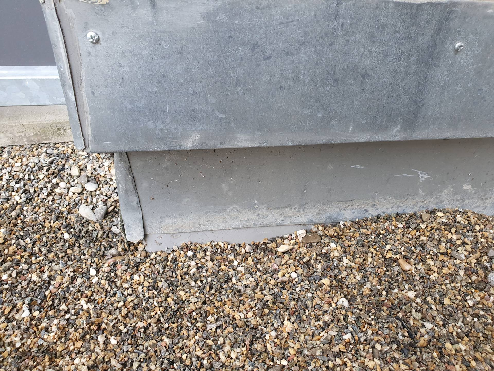

# 8424-0376 &ndash; DG Terrasse Vlies nicht hoch genug, Haus 9

_[&lt; zurück](../../index.md)_

_Bauträger Vorgangsnummer: 8424-0376_



Der Aufbau der Dachterrasse ist: Beton, Bitumenbahn, Dämmung, Folienabdichtung, Vlies, Splitt, Terrassenplatten. Die Folienabdichtung ist an den Wandbereichen hochgezogen.

Es hat sich herausgestellt, dass das Vlies in den Randbereichen nicht lang (hoch) genug ist und Splitt direkten Kontakt mit der Folienabdichtung hat.

Es ist zu klären, ob dies so zulässig ist und ein Problem darstellen kann. Sollte Splitt die Folie beschädigen würde dies zu weiteren Wasserschäden führen.

## Fotos

2023-11-04

2023-11-04

2023-11-04

