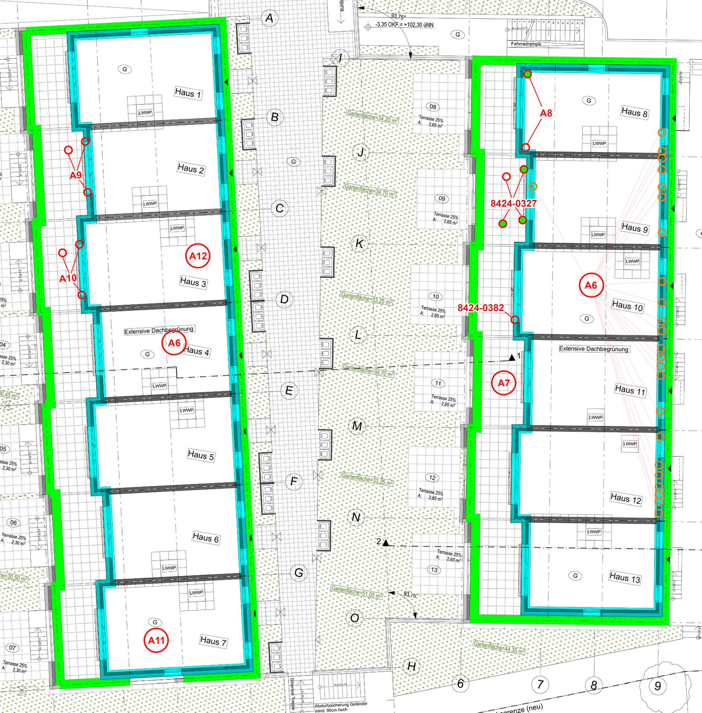

# Mängel Dachflächen

Neben mehreren Gewerken bei denen fragwürdig ist, ob sie fachmännisch
nach Stand der Technik umgesetzt wurden, haben wir auf den Dachflächen aktuell noch die unten genannten konkreten offenen Mängel.

- [Mängel Dachflächen](#mängel-dachflächen)
  - [Historie](#historie)
    - [Dachterrassen](#dachterrassen)
    - [Flachdach](#flachdach)
  - [Offene Mängel](#offene-mängel)
    - [Dach 1-7](#dach-1-7)
    - [Dachterasse 1-7](#dachterasse-1-7)
    - [Dach 8-13](#dach-8-13)
    - [Dachterrasse 8-13](#dachterrasse-8-13)

## Historie

### Dachterrassen

Auf inzwischen drei Dachterrassen hat haben sich ähnliche Wasserschäden ergeben.\
Zum einen war/ist die Folienabdichtung im Bereich der Rollladenleisten unzureichend hoch abgedichtet (da die Rollladenleisten meist schon montiert waren). Dadurch lief Wasser hinter und unter die Folienabdichtung bis in die Dämmschicht.\
Zum anderen hatte der Elektriker, für Stromkabel der Deckenbeleuchtung, durch die Wand im DG und durch die Decke (und Dampfsperre) der Dachterrasse nach unten ins 1.OG gebohrt.

Bei [A9] und [A10] lief Wasser hinter die Folie und durch die Löcher in der Dampfsperre und Decke bis ins 1.OG und tropfte aus der Brennstelle.\
Hier wurde mutmaßlich unfachmännisch abgedichtet, lediglich stehendes Wasser mit einem Bausauger grob ausgesaugt und wieder verschlossen.

Bei [8424-0327] lief das Wasser hinter die Folie und durch das Loch in der Wand auf den Betonboden im 2.OG bis zum Treppenhaus und hat dort die Trocknenbauteile durchnässt und schimmeln lassen.
Der Innenbereich wurde wiederhergestellt. Die Dämmschicht außen wurde 2023 und wieder 2024 erfolglos getrocknet. Zwischenzeitlich wurde eine Leckortung durchgeführt, welche zwei Schitte in der Folie und ein kleines Loch bei [A7] identifiert hatte. Weitere erfolglose Trocknungsversuche haben eine Leckage am Kaldomat ergeben. Dieser wurde ebenfalls abgedichtet.\
Aktuell tritt trotzdem weiterhin Wasser ein. Nach Regen ist ca. 1cm stehendes Wasser im rechten Kaldomat. Der Bauträger reagiert seit April 2024 nicht mehr auf Anfragen!

[A7] wurde bei einer Leckortung gefunden. Die Leckage wurde zügig abgedichtet. Er wurde keine Öffnung (Kontrolle) und auch keine Trocknung durchgeführt. Die Eigentümerin wurde (meines Wissens) auch nicht informiert.

Bei den Arbeiten an [8424-0327] wurde ersichtlich, dass evtl. die Folienabdichtung der Dachterrasse tiefer ist als der Abfluss ([8424-0375]).
Außerdem, dass das Terrasse Vlies nicht hoch genug verlegt wurde, der Splitt hat Kontakt mit der Folie ([8424-0376]).

### Flachdach

Bei [A8] hatte sich Schimmel im 2.OG an der Wand gebildet. Daraufhin wurde eine Leckortung durchgeführt. Es wurden zwei kleine Löcher in den Ecken-Verschweißungen der Folienabdichtung gefunden. Die Löcher wurden abgedichtet. Es wurde keine Öffnung (Kontrolle) vorgenommen und keine Trocknung!\
Aktuell ist das untere Loch (im Plan) erneut undicht.

Im Rahmen der Leckortung wurde auch das vordere Haus untersucht, was kleine Leckagen bei [A11] und [A12] ergeben hat.\
Bei [A11] wurde (vermutlich) abgedichtet, aber nicht geöffnet und getrocknet.\
Bei [A12] wurde geöffner, abgedichtet, aber nicht getrocknet, der Sachverhalt ist dort [etwas komplizierter][A12].

Bei der Dachwartung 2024 wurden pro Häuserreihe mindestens 20 Stellen gefunden, an denen sich die Folienabdichtung auf der Attika löst, siehe [A6]. Generell ist fraglich, ob die Ausführung so zulässig ist - die Folie ist offen, ungeschützt, ohne Blechverkleidung.

Bei [8424-0382] sind große schwarze Flecken auf der Fassade im Bereich des Rollladens. Dies könnte evtl. auf eine Leckage im Dach zurückzuführen sein - z.B. Wasser hinter der Fassadendämmung.

## Offene Mängel

### Dach 1-7

- [A6] &ndash; Folienabdichtung auf Attika löst sich an zahlreichen Stellen bei allen Häusern

  |Bemerkt|Gemeldet|Frist|Behoben|Risiko|
  |---|---|---|---|---|
  |12.04.2024|12.06.2024|15.07.2024|🔴nein|🔴hoch|

- [A11] &ndash; Leckage Dach, Haus 7

  |Bemerkt|Gemeldet|Frist|Behoben|Risiko|
  |---|---|---|---|---|
  |23.02.2023|?| |🟡teilweise|🔴hoch|

- [A12] &ndash; Leckage Dach, Haus 3

  |Bemerkt|Gemeldet|Frist|Behoben|Risiko|
  |---|---|---|---|---|
  |30.06.2020|ja||🟡teilweise|🔥sehr hoch|

### Dachterasse 1-7

- [A9] &ndash; Wasserschaden Dachterrasse, Haus 2

  |Bemerkt|Gemeldet|Frist|Behoben|Risiko|
  |---|---|---|---|---|
  |April 2020|ja|nein|🟡teilweise|🔴hoch|

- [A10] &ndash; Wasserschaden Dachterrasse, Haus 3

  |Bemerkt|Gemeldet|Frist|Behoben|Risiko|
  |---|---|---|---|---|
  |?|ja||🟡teilweise|🔴hoch|

### Dach 8-13

- [A8] &ndash; 2 Leckagen Dach, Haus 8

  |Bemerkt|Gemeldet|Frist|Behoben|Risiko|
  |---|---|---|---|---|
  |23.02.2023|ja||🟡teilweise|🔥sehr hoch|

- [A6] &ndash; Folienabdichtung auf Attika löst sich an zahlreichen Stellen bei allen Häusern

  |Bemerkt|Gemeldet|Frist|Behoben|Risiko|
  |---|---|---|---|---|
  |12.04.2024|12.06.2024|15.07.2024|🔴nein|🔴hoch|

- [8424-0382] &ndash; Schimmel Fassade Haus 10

  |Bemerkt|Gemeldet|Frist|Behoben|Risiko|
  |---|---|---|---|---|
  |05.04.2024|05.04.2024||🔴nein|🔴hoch|

### Dachterrasse 8-13

- [A7] &ndash; Leckage Dachterrasse, Haus 11

  |Bemerkt|Gemeldet|Frist|Behoben|Risiko|
  |---|---|---|---|---|
  |18.09.2023|nein||🟡teilweise|🔴hoch|

- [8424-0327] &ndash; Wasserschaden Dachterrasse, Haus 9

  |Bemerkt|Gemeldet|Frist|Behoben|Risiko|
  |---|---|---|---|---|
  |19.10.2022|19.10.2022|30.06.2024|🟡teilweise|🔥sehr hoch|

- [8424-0375] &ndash; DG Terrasse Folie tiefer als Abfluss, Haus 9

  |Bemerkt|Gemeldet|Frist|Behoben|Risiko|
  |---|---|---|---|---|
  |18.09.2023|08.01.2024|15.03.2024|🔴nein|🟠mittel|

- [8424-0376] &ndash; DG Terrasse Vlies nicht hoch genug, Haus 9

  |Bemerkt|Gemeldet|Frist|Behoben|Risiko|
  |---|---|---|---|---|
  |18.09.2023|08.01.2024|15.03.2024|🔴nein|🟠mittel|
    
[Startseite]: ../index.md
[A6]: A6/index.md
[A11]: Dach1-7/A11/index.md
[A12]: Dach1-7/A12/index.md
[A9]: Dachterrasse1-7/A9/index.md
[A10]: Dachterrasse1-7/A10/index.md
[A8]: Dach8-13/A8/index.md
[8424-0382]: Dach8-13/8424-0382/index.md
[A7]: Dachterrasse8-13/A7/index.md
[8424-0327]: Dachterrasse8-13/8424-0327/index.md
[8424-0375]: Dachterrasse8-13/8424-0375/index.md
[8424-0376]: Dachterrasse8-13/8424-0376/index.md
