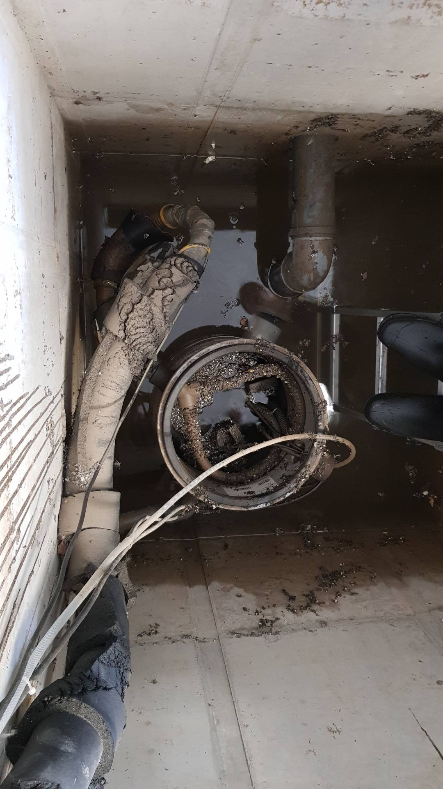

# A1 &ndash; Hebepumpe ausgetauscht, aber keine Betonversiegelung

_[&lt; zurück](../../index.md)_



## Ursprünglicher Meldungstext

> Status: gemeldet 2020\
> Raum: Tiefgarage\
> Beschreibung: Hebeanlage Tiefgarage unterdimensioniert und mangelhaft eingebaut (Flexible Schläuche statt festes Rohr; keine Auftriebsicherung; …)\
> -> Pumpen gegen größere ausgetauscht. Förderleistung gut. Auffangbehälter aus Kunststoff entfernt. WU-Beton wird direkt mit Fzg.-Betriebsmitteln und Salzen beaufschlagt. Bewährung wird sich üerb die Zeit zersetzen. Teile der neuen Hebeanlage sind aus verzinktem Stahl. Dieser rostet massiv an den dauerhaft unter Wasser stehenden teilen. Technisch mangelhafte Ausführung.\
> Frist: 31.03.2021

## Aktueller Stand

Die Pumpe wurde inzwischen ausgetauscht durch zwei leistungsstärkere Pumpen.

Allerdings sieht das neue Pumpenkonzept vor, dass der Schacht dauerhaft unter Wasser steht. Die alte Pumpe hatte einen Behälter, in den Wasser eingeleitet wurde. Der Schacht sollte kein Wasser enthalten (hätte die Pumpe korrekt funktioniert).

Durch das neue Konzept sind die Betonwände dauerhaft Schmutzwasser, z.B. mit Streusalz, ausgesetzt. Der Beton ist unseres erachtens nach nicht durch eine Beschichtung geschützt. Dies hat mutmaßlich zur Folge, dass der Beton auf Dauer geschädigt wird.

- _Siehe außerdem_ [_Zulaufrohr dauerhaft unter Wasser (A1B)_](../A1B/index.md)
- _Siehe außerdem_ [_Montageteile Hebepumpe korrodieren (A1C)_](../A1C/index.md)

(Foto alte Pumpe)\
2020-08-17
