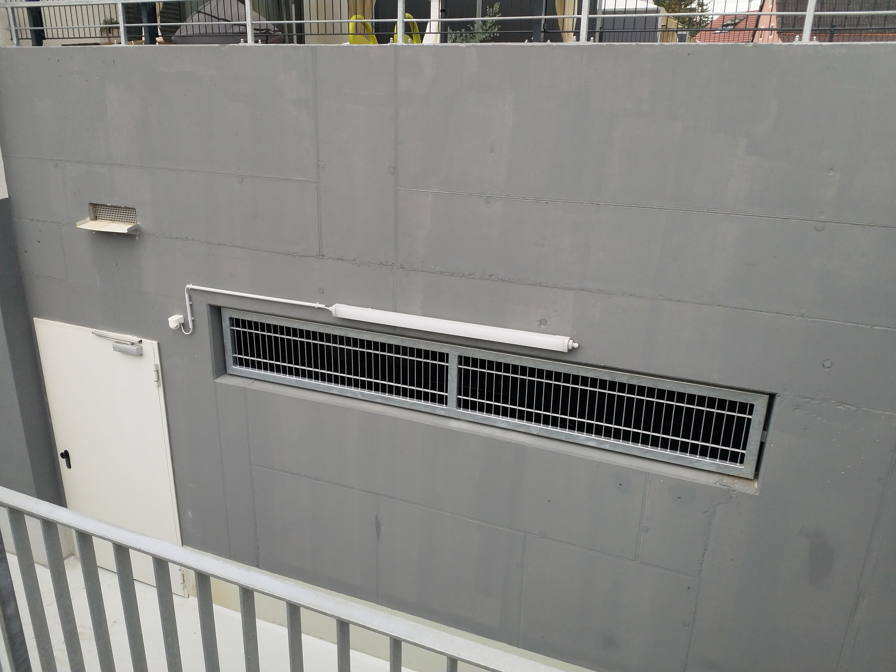

# I &ndash; Lüftungsöffnungen bekommen Blechbänke Mit Gefälle nach außen

_[&lt; zurück](../../index.md)_



## Ursprünglicher Meldungstext

> Status: Im Abnahmeprotokoll; Teilweise erledigt\
> Raum: Tiefgarage\
> Beschreibung: Lüftungsöffnungen bekommen Blechbänke Mit Gefälle nach außen.\
> -> Auf Waagrechten Flächen mit Putz erledigt. Betonflächen ohne Fensterbänke nach außen. Fraglich ob weitere Handhabe.\
> Frist: 31.03.2021

