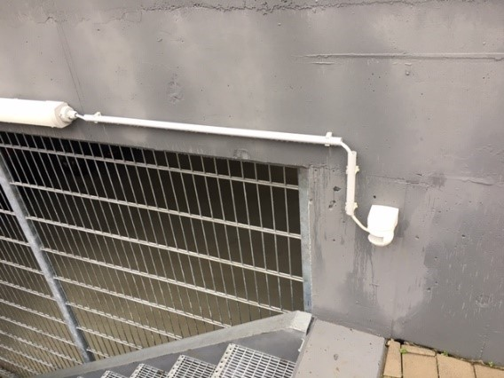

# O &ndash; Kabel TG-Elektrik Außenbereich nicht für Außeneinsatz geeignet

_[&lt; zurück](../../index.md)_



## Ursprünglicher Meldungstext

> Status: Neu (Nach Abnahme); nicht erledigt\
> Raum: Tiefgarage\
> Beschreibung: Kabel TG-Elektrik Außenbereich nicht für Außeneinsatz geeignet\
> -> NYM Leitungen im freien verlegt müssen nach VDE Witterungs-/UV-geschützt sein. Nicht vollständig ausgeführt, daher klarer Mangel.\
> Frist: 31.03.2021

