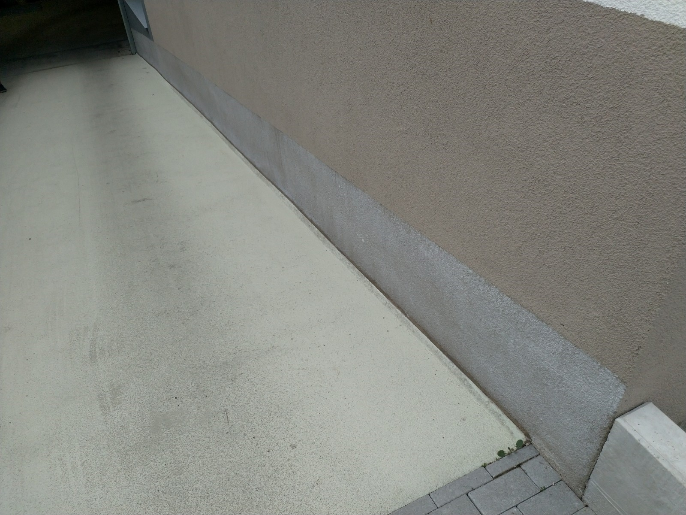

# M &ndash; Sockelputz an Haus 1 generiert weißlichen Belag

_[&lt; zurück](../../index.md)_



## Ursprünglicher Meldungstext

> Status: Neu (Nach Abnahme)\
> Raum: Tiefgarageneinfahrt\
> Beschreibung: Sockelputz an Haus 1 generiert weißlichen Belag\
> -> Kein technischer Mangel. Nach mehreren baufachlichen Meinung unproblematisch.\
> Frist: 31.03.2021

## Weitere Historie

EMail vom 27. September 2023 an Bauträger:

> Sie wollten recherchieren bzgl. des weißen Materials, dass an den Ecken der Tiefgarage austritt (in Garten Haus 13 und am Tiefgaragenabgang Nord) und welche Maßnahmen erforderlich sind.

[Bauträger EMail (14.07.2024)]:

> Punkt neu l: Bauträger prüft, ob oberhalb der Rampenwand (Beton) Handlungsbedarf besteht – **Dieser Punkt wurde erledigt.**

## Fotos

[Bauträger EMail (14.07.2024)]: https://drive.google.com/file/d/19hDpQ9SWxaemkfX0wXpxzCk9p0P5WIK4/view?usp=drive_link
