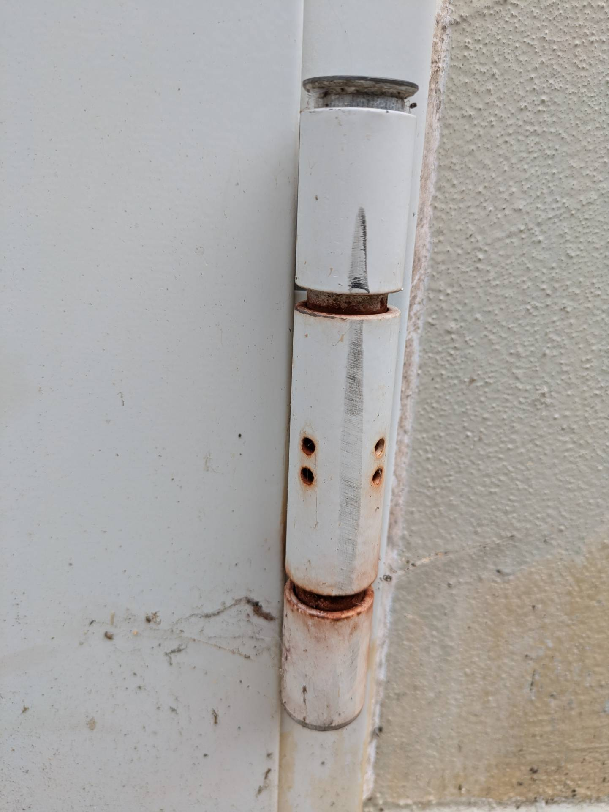
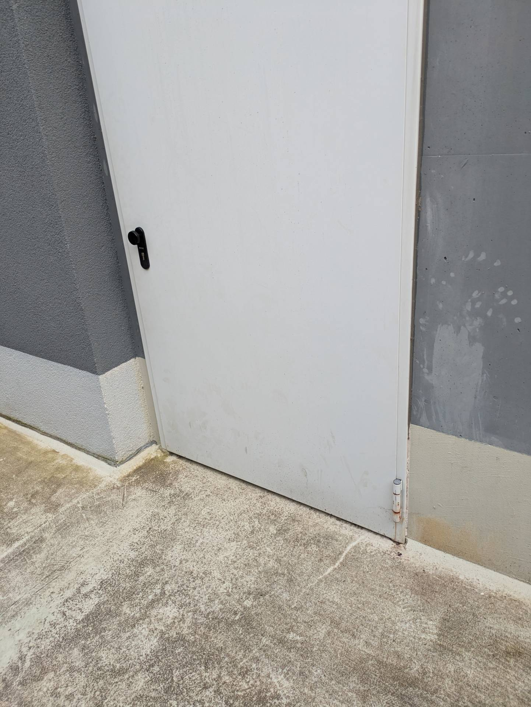

# A13 &ndash; Tiefgarage Türscharnier rostet

_[&lt; zurück](../../index.md)_



Das Scharnier der Tiefgaragentür rostet. Ist diese für den Außenbereich zugelassen, oder warum rostet es?

2024-06-19

2024-06-19

