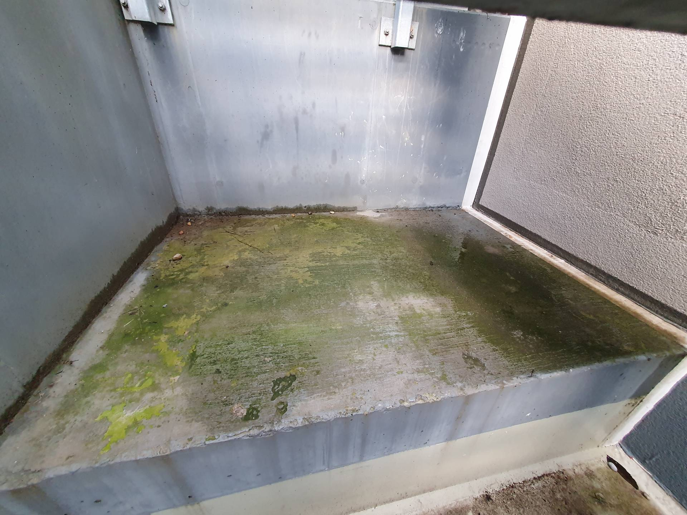

# A2 &ndash; Unter Treppe Tiefgarage Schlagregen, Wasser bleibt stehen. Moosbildung.

_[&lt; zurück](../../index.md)_



## Ursprünglicher Meldungstext

> Status: offen, nicht gemeldet\
> Raum: Abgang TG Nord\
> Beschreibung: unter Treppe Tiefgarage Schlagregen, Wasser bleibt stehen. Moosbildung. Gefälle sollte hergestellt werden.\

## Fotos

2023-09-01
