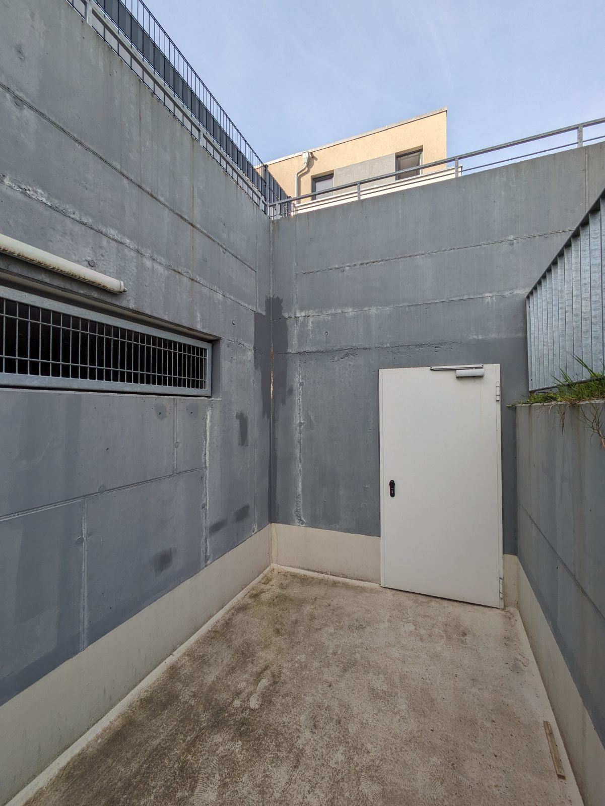
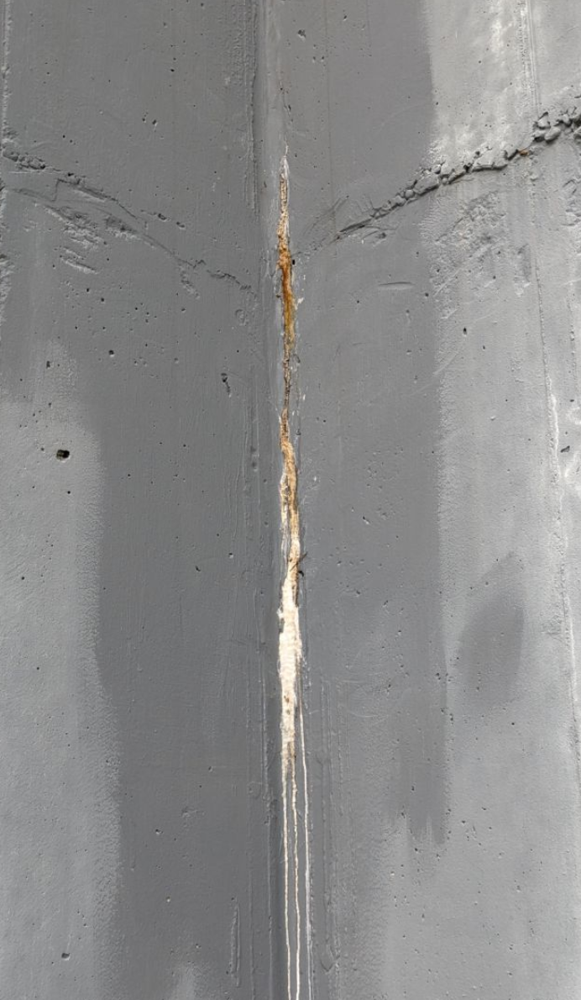

# A3 &ndash; Undichte Betonwand. Auswaschungen/Kristalisierung in Mauerecke zu Garten Haus #8

_[&lt; zurück](../../index.md)_



## Ursprünglicher Meldungstext

> Status: offen, bereits ein Abstellversuch, nicht nachgemeldet\
> Raum: Abgang TG Nord\
> Beschreibung: Auswaschungen/Kristalisierung in Mauerecke zu Garten Haus #8.\
> -> Bereits ein Abstellversuch unternommen. Vermutlich nur übermalt und nicht zusätzlich mit Dichtmaterial verpresst. Gleiche Auswaschungen traten wieder auf. 

