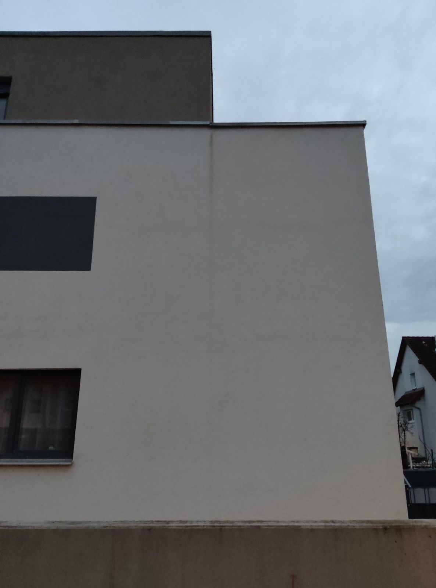

# A4 &ndash; Laufspuren durch Regenwasser an Außenwand über TG-Einfahrt (Haus 1)

_[&lt; zurück](../../index.md)_



## Ursprünglicher Meldungstext

> Status: offen,\
> Raum: Nordwand Haus 1\
> Beschreibung: Laufspuren durch Regenwasser an Außenwand über TG-Einfahrt. Verursacht durch Mangelhafte Ausführung Tropfblech Attika 2ter Stock.\

