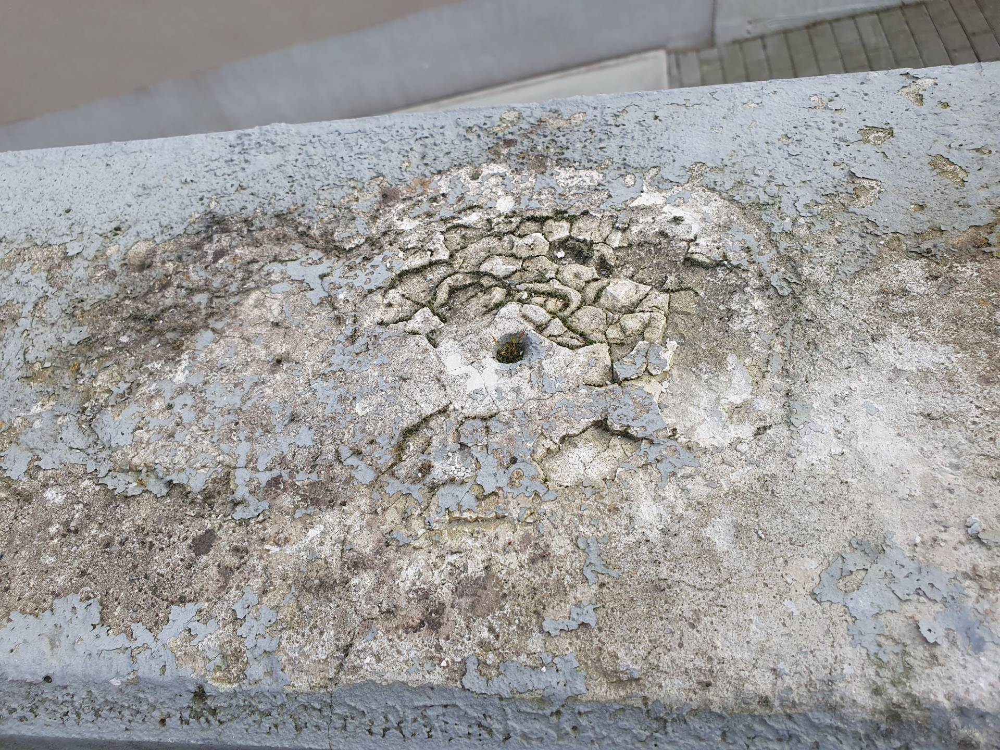
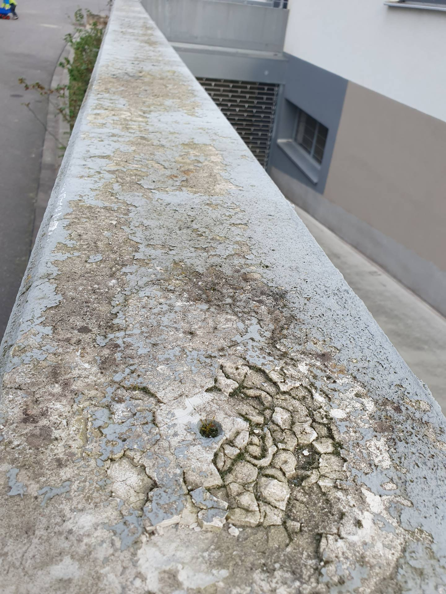
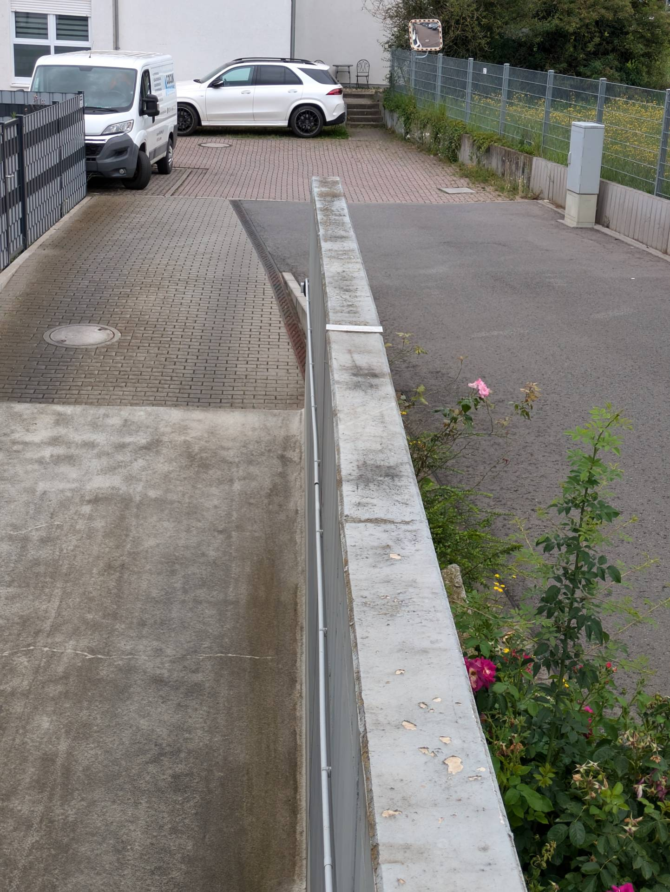
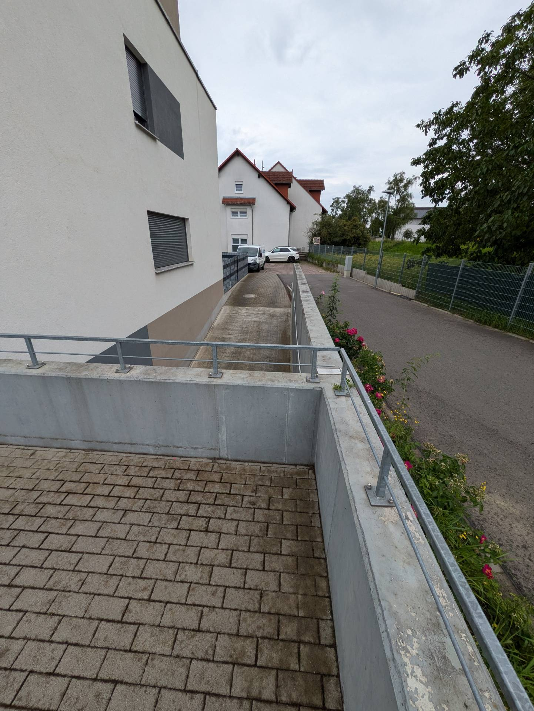
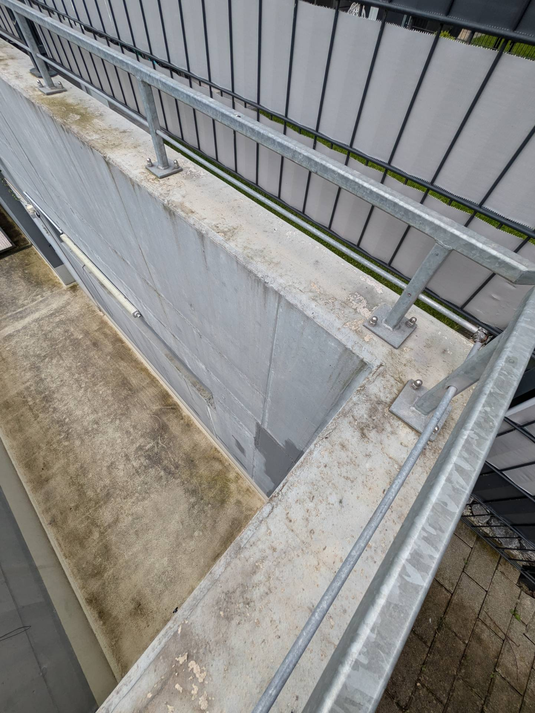

# A5 &ndash; Schutz gegen Schlagregen/Bewitterung auf Betonmauern fehlt

_[&lt; zurück](../../index.md)_



## Ursprünglicher Meldungstext

> Status: offen,\
> Raum: Oberflächen der Betonmauern im Außenbereich TG Nord\
> Beschreibung: Schutz gegen Schlagregen/Bewitterung fehlt. Erste Mängel an Betonoberflächen treten auf.

## Fotos

2024-03-09

2024-03-09

2024-06-22

2024-06-22

2024-06-22

