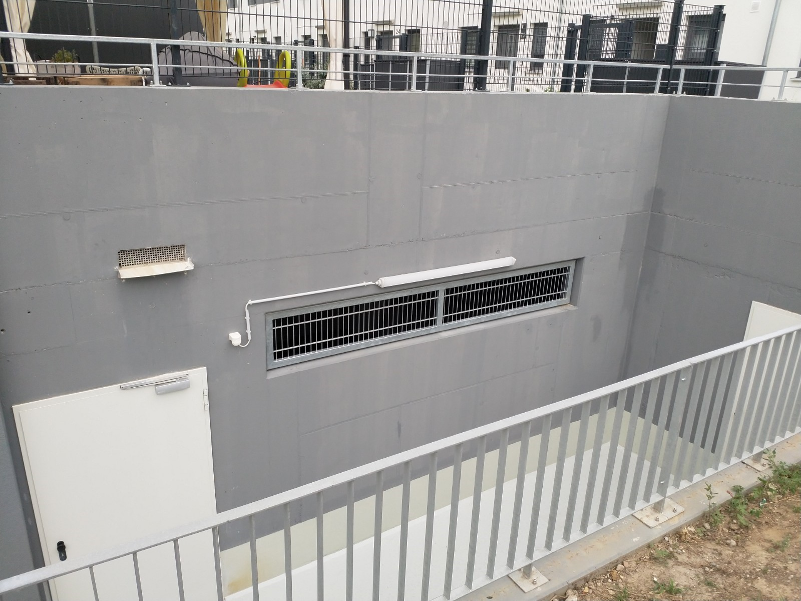
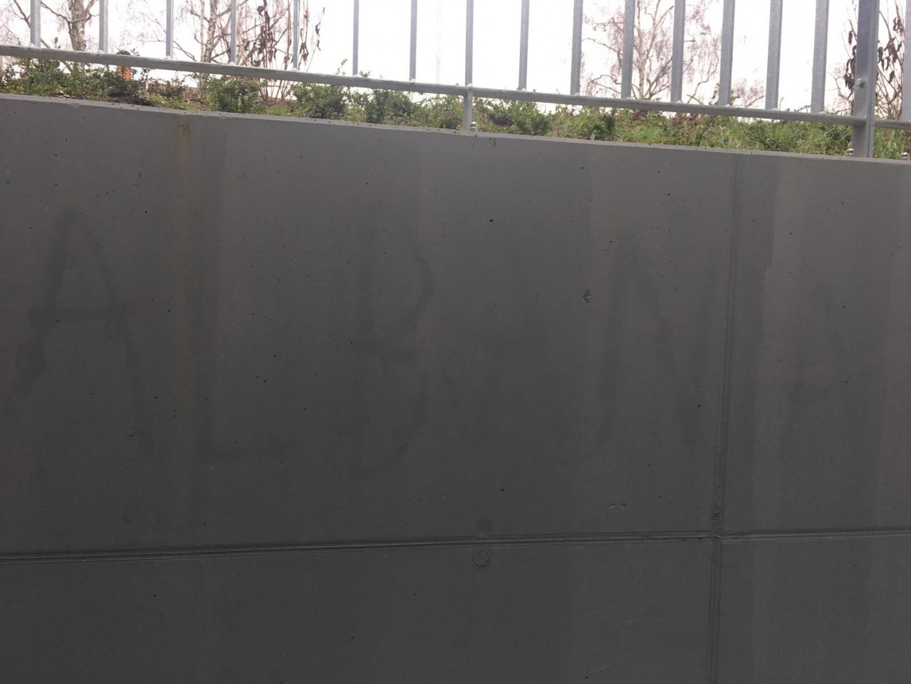
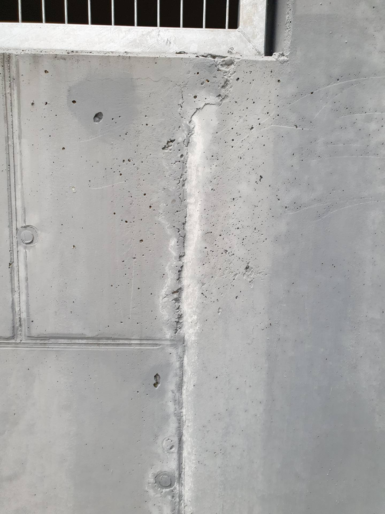

# G &ndash; Anstrich mangelhaft und fleckig. Von den Rohbauarbeitern hinterlassener Schriftzug "Albania" zu lesen.

_[&lt; zurück](../../index.md)_



## Ursprünglicher Meldungstext

> Status: Neu (Nach Abnahme); nicht erledigt\
> Raum: Treppenabgang/Ausgang Tiefgarage Nord\
> Beschreibung: Anstrich mangelhaft und fleckig. Von den Rohbauarbeitern hinterlassener Schriftzug “Albania” zu lesen.\
> Frist: 31.03.2021

2024-03-09
