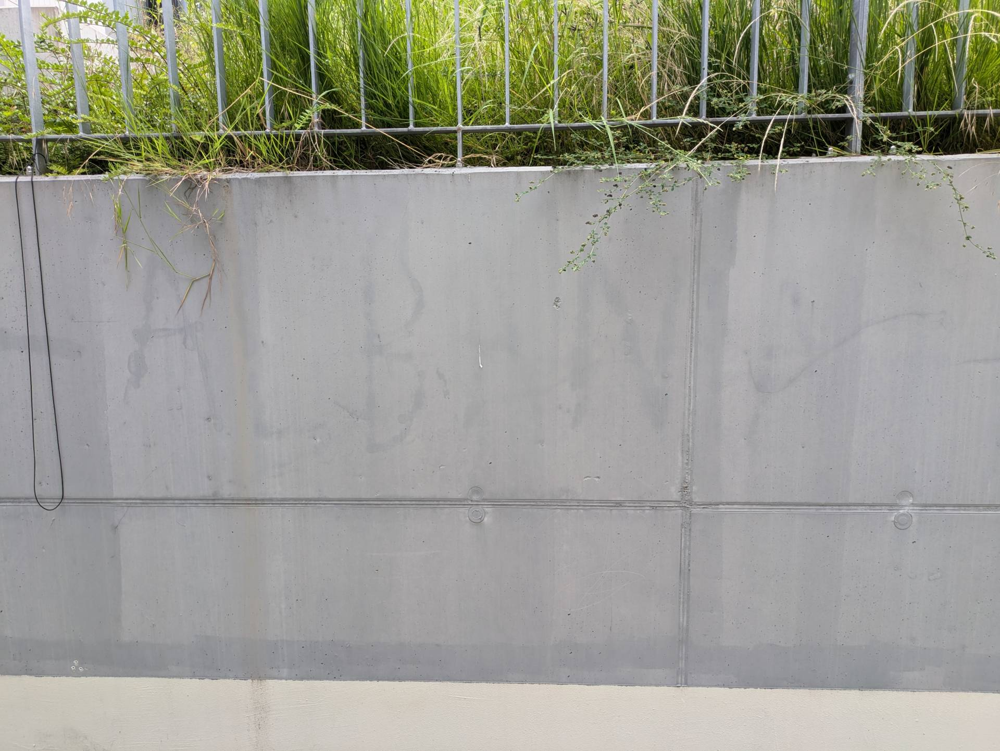

# G &ndash; Anstrich mangelhaft und fleckig. Von den Rohbauarbeitern hinterlassener Schriftzug "Albania" zu lesen.

_[&lt; zurück](../../index.md)_



## Ursprünglicher Meldungstext

> Status: Neu (Nach Abnahme); nicht erledigt\
> Raum: Treppenabgang/Ausgang Tiefgarage Nord\
> Beschreibung: Anstrich mangelhaft und fleckig. Von den Rohbauarbeitern hinterlassener Schriftzug “Albania” zu lesen.\
> Frist: 31.03.2021

## Weitere Historie

[Bauträger EMail (14.07.2024)]:

> Punkt G: Herr K. wird nachschauen, ob er Bauträger Bilder zur Verfügung stellen kann. Anschließend erfolgt die Prüfung – offen

## Fotos

2024-06-28

2024-03-09 Schriftzug immer noch lesbar!

[Bauträger EMail (14.07.2024)]: https://drive.google.com/file/d/19hDpQ9SWxaemkfX0wXpxzCk9p0P5WIK4/view?usp=drive_link
