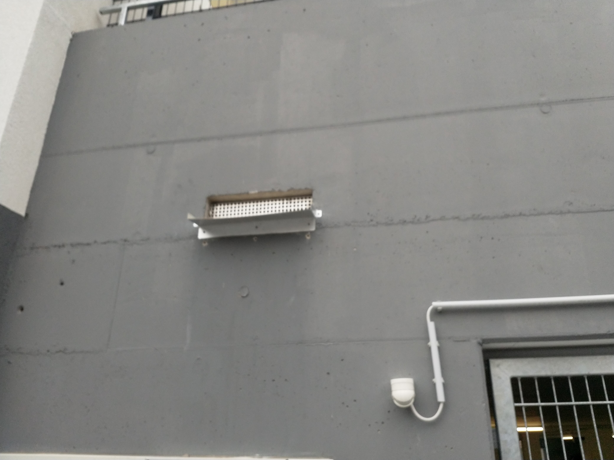

# R &ndash; Notüberlauf TG-Dach Nord unbearbeitet

_[&lt; zurück](../../index.md)_



## Ursprünglicher Meldungstext

> Status: Im Abnahmeprotokoll; hinfällig\
> Raum: Treppenzugang TG Nord\
> Beschreibung: Notüberlauf TG-Dach Nord unbearbeitet. Entscheidung WEG: Notüberlauf geöffnet lassen, Entwässerung in Ablaufrinne Zugang TG Nord.\
> -> Wurde mit Einbringung einer zusätzlichen Drainage auf TG-Dach verschlossen. Nicht mehr benötigt.\
> Frist: 31.03.2021

## Fotos

