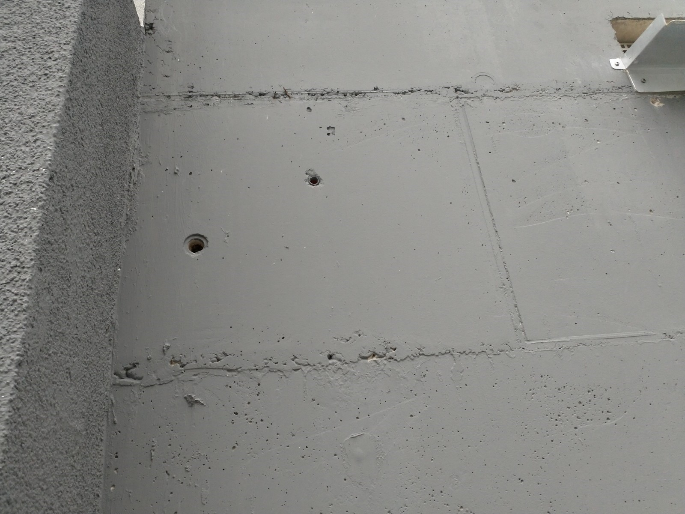

# S &ndash; Nicht geschlossene Löcher von Verschalungsarbeitung in Wand TG Nord

_[&lt; zurück](../../index.md)_



## Ursprünglicher Meldungstext

> Status: Neu (Nach Abnahme), Erledigt\
> Raum: Treppenzugang TG Nord\
> Beschreibung: Nicht geschlossene Löcher von Verschalungsarbeitung in Wand TG Nord\
> Frist: 31.03.2021

