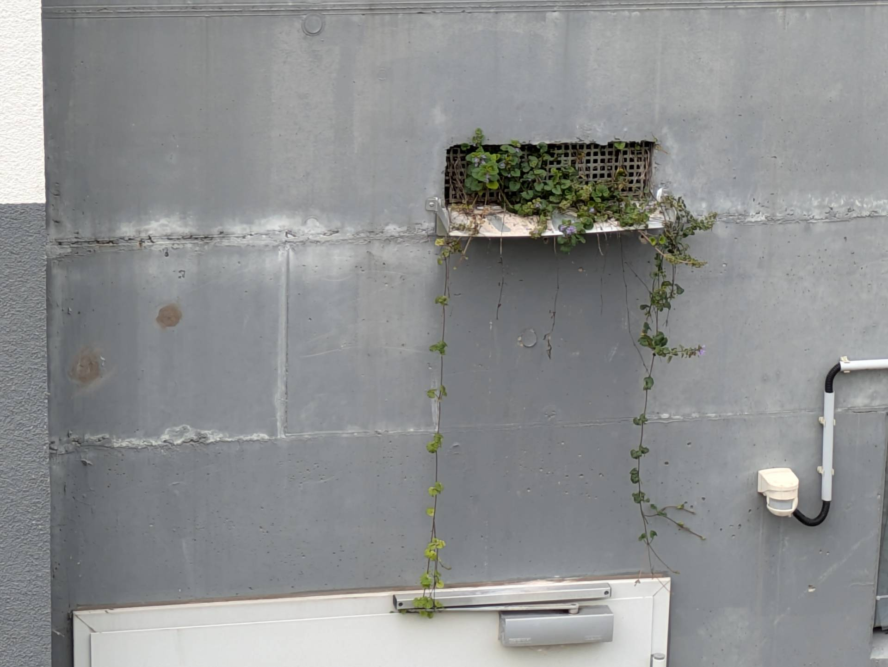
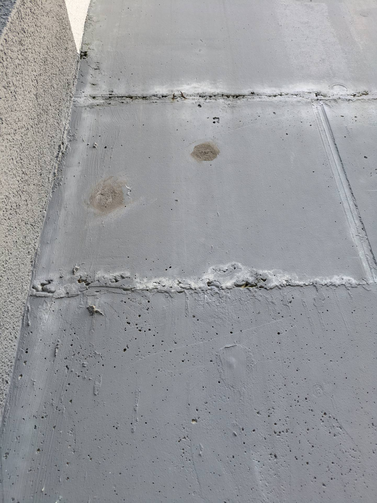

# S &ndash; Nicht geschlossene Löcher von Verschalungsarbeitung in Wand TG Nord

_[&lt; zurück](../../index.md)_



## Ursprünglicher Meldungstext

> Status: Neu (Nach Abnahme), Erledigt\
> Raum: Treppenzugang TG Nord\
> Beschreibung: Nicht geschlossene Löcher von Verschalungsarbeitung in Wand TG Nord\
> Frist: 31.03.2021

## Weitere Historie

[Bauträger EMail (14.07.2024)]:

> Punkt S: Die zwei Löcher werden geschlossen - Dieser Punkt wurde erledigt. 

Anmerkung WEG: Die Löcher wurden zwar geschlossen, allerdings ist nun noch ein Anstrich notwendig (siehe Fotos)! Dies könnte mit [Punkt G](../G/index.md) kombiniert werden.

## Fotos

2024-06-23

2024-06-23

[Bauträger EMail (14.07.2024)]: https://drive.google.com/file/d/19hDpQ9SWxaemkfX0wXpxzCk9p0P5WIK4/view?usp=drive_link
