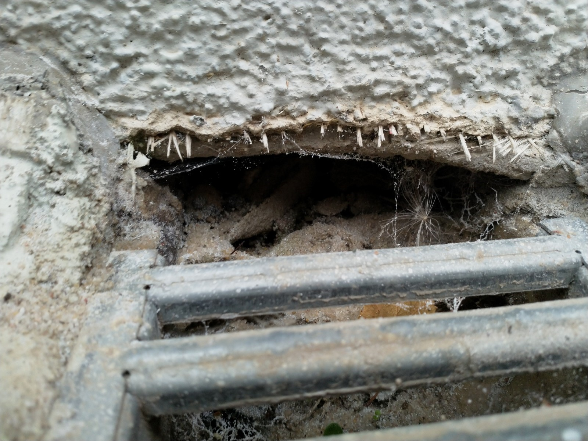
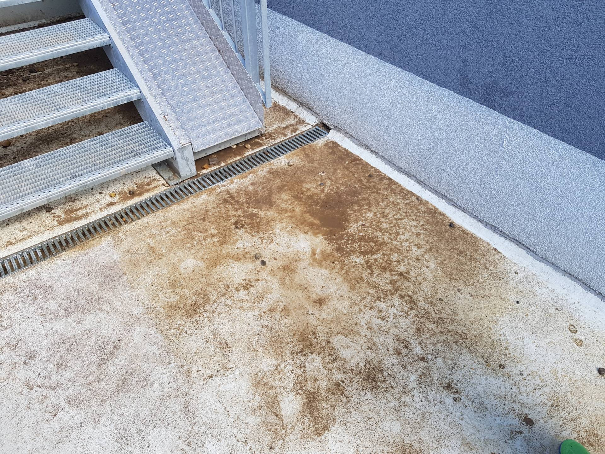
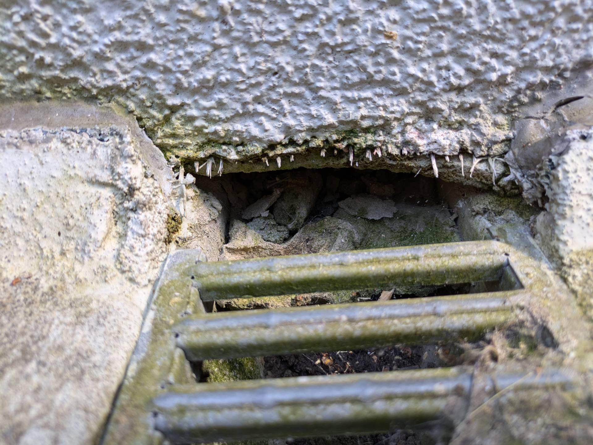

# T &ndash; Entwässerungsrost ist nicht abnehmbar und WDVS Abschluss Mit Flexyl nachbessern

_[&lt; zurück](../../index.md)_



## Ursprünglicher Meldungstext

> Status: Neu (Nach Abnahme); möglicherweise nur optisch\
> Raum: Treppenzugang TG Nord\
> Beschreibung: Entwässerungsrinne Treppenzugang TG Nord Wandübergang mangelhaft\
> Frist: 31.03.2021

## Weitere Historie

[Bauträger EMail (14.07.2024)]:

> Punkt T: Bauträger prüft, ob hier weitere Maßnahmen erforderlich sind. Rückmeldung erfolgt – Dieser Punkt ist noch offen, da uns noch eine Rückmeldung fehlt. Wir sind jedoch dabei zu prüfen, ob hier Maßnahmen oder Arbeiten erforderlich sind.

## Fotos

2020-05-04

2024-06-24

[Bauträger EMail (14.07.2024)]: https://drive.google.com/file/d/19hDpQ9SWxaemkfX0wXpxzCk9p0P5WIK4/view?usp=drive_link
