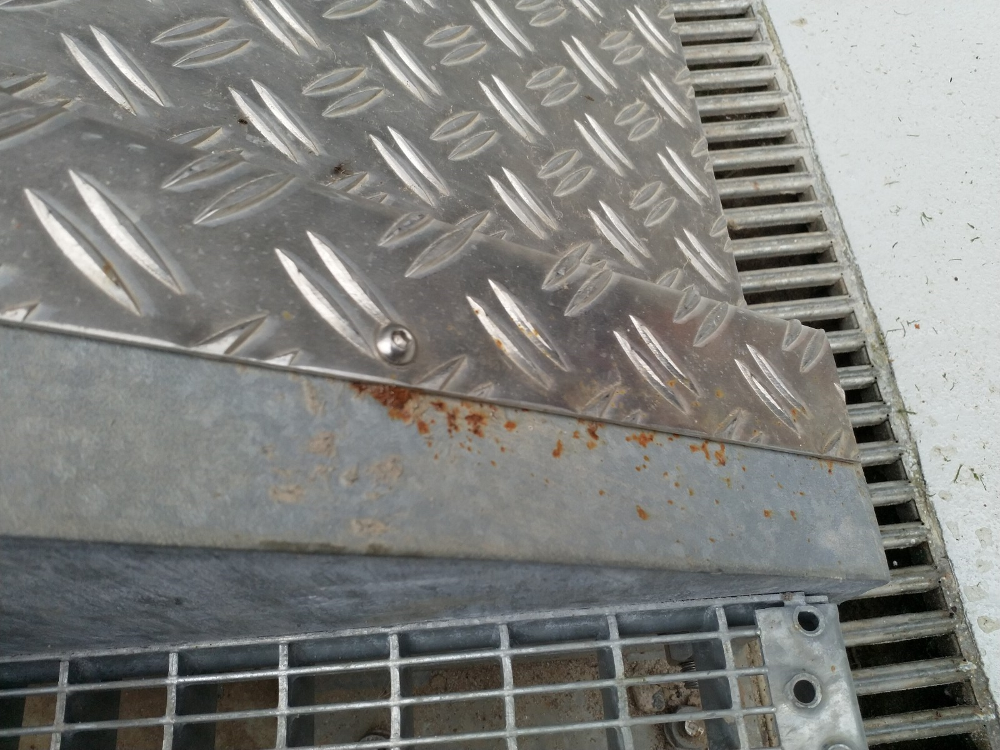

# U &ndash; Mangelhaftet Korrosionsschutz Verbindungsstellen Fahrradrampe TG-Nord

_[&lt; zurück](../../index.md)_



## Ursprünglicher Meldungstext

> Status: Neu (Nach Abnahme)\
> Raum: Treppenzugang TG Nord\
> Beschreibung: Mangelhaftet Korrosionsschutz Verbindungsstellen Fahrradrampe TG-Nord.\
> -> Wurde nur mit Zinkspray übersprüht; Mangelhafte Ausführung; rostet nach wenigen Wochen schon wieder\
> Frist: 31.03.2021

