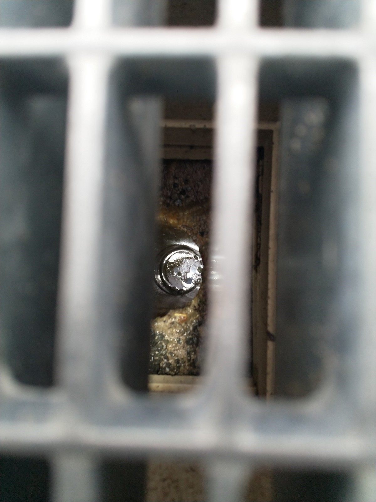

# A &ndash; Sand-/Kiesfänge in Entwässerungskästen fehlen

_[&lt; zurück](../../index.md)_



## Ursprünglicher Meldungstext

> Status: Im Abnahmeprotokoll, Erledigt\
> Raum: Fußweg zwischen Häusern auf Tiefgarage.\
> Beschreibung: Sand-/Kiesfänge in Entwässerungskästen fehlen.\
> Frist: 31.03.2021

## Weitere Historie

[Bauträger EMail (14.07.2024)]: 

> "Punkt A: Hier wird ein Kiesfanggitter ergänzt – Dieser Punkt wurde erledigt."

## Fotos

[Bauträger EMail (14.07.2024)]: https://drive.google.com/file/d/19hDpQ9SWxaemkfX0wXpxzCk9p0P5WIK4/view?usp=drive_link
