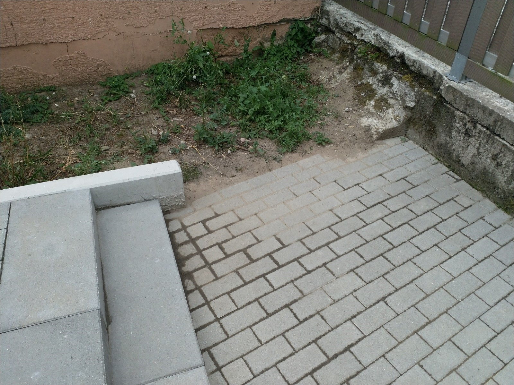

# D &ndash; Privatweg Südostecke Haus 13: L-Steine mit Kantensteinen erweitern

_[&lt; zurück](../../index.md)_



## Ursprünglicher Meldungstext

> Status: Im Abnahmeprotokoll, erledigt\
> Raum: Privatweg, Südostecke WEG-Grundstück\
> Beschreibung: Privatweg Südostecke Haus 13: L-Steine mit Kantensteinen erweitern. Ausführung der Kantensteine tiefer als der L-Stein.\
> Frist: 31.03.2021

