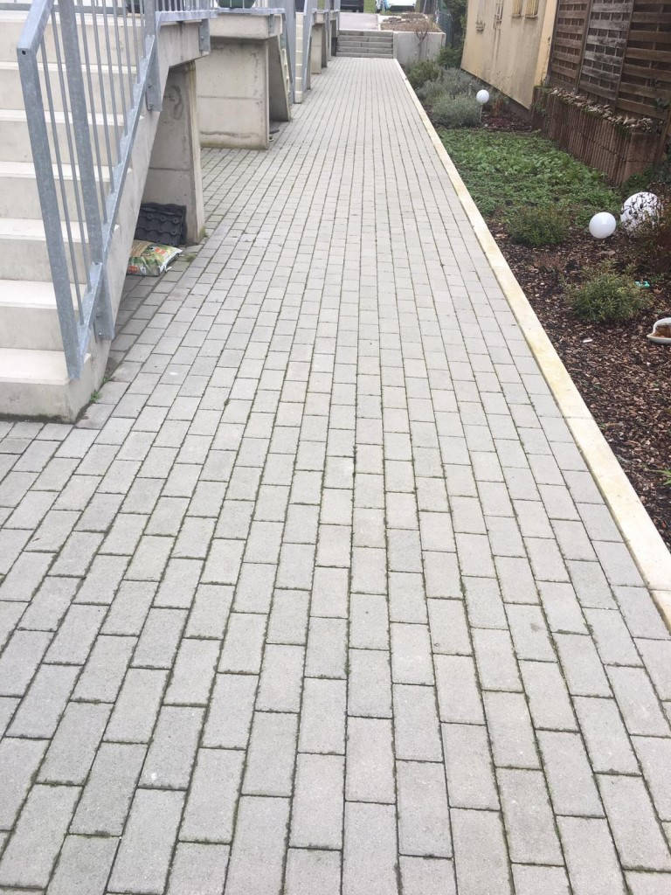

# E &ndash; Zugangswege nachsanden

_[&lt; zurück](../../index.md)_



## Ursprünglicher Meldungstext

> Status: Im Abnahmeprotokoll, erledigt\
> Raum: Zugangswege Haus 8-13\
> Beschreibung: Zugangswege nachsanden (Pflasterwege).\
> Frist: 31.03.2021

## Historie

[Bauträger EMail (14.07.2024)]:

> Punkt E: der vordere Teil wird mit Splitt nachgesandet - Dieser Punkt wurde erledigt. 

## Fotos

[Bauträger EMail (14.07.2024)]: https://drive.google.com/file/d/19hDpQ9SWxaemkfX0wXpxzCk9p0P5WIK4/view?usp=drive_link
