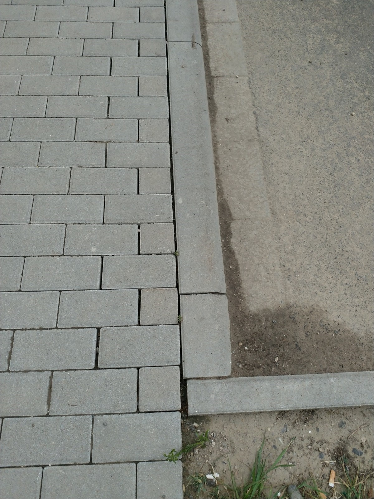

# F &ndash; Giebelwand Haus 8: Ein Pflasterstein ist zu kurz

_[&lt; zurück](../../index.md)_



## Ursprünglicher Meldungstext

> Status: Im Abnahmeprotokoll, erledigt\
> Raum: Privatweg Giebelwand Haus 8\
> Beschreibung: Giebelwand Haus 8: Ein Pflasterstein ist zu kurz.\
> Frist: 31.03.2021

