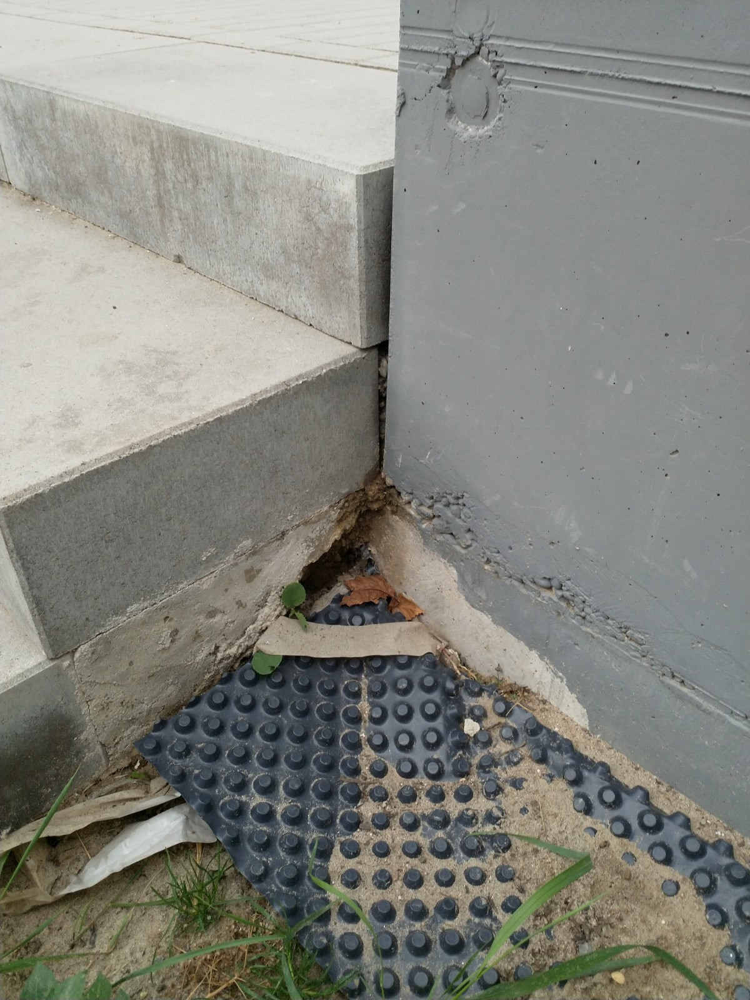
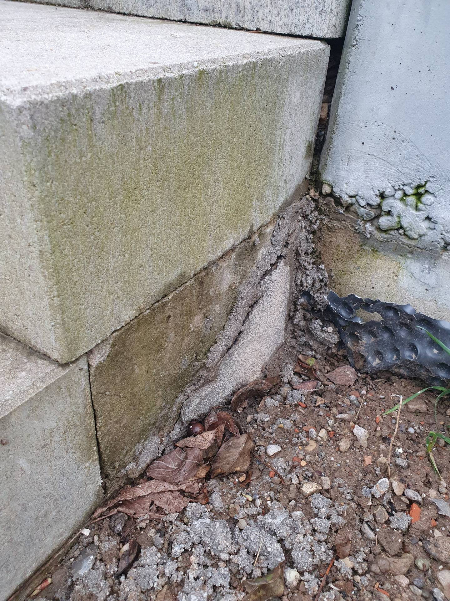

#  &ndash; 

_[&lt; zurück](../../index.md)_



## Ursprünglicher Meldungstext

> Status: Neu (Nach Abnahme); teils erledigt\
> Raum: Treppenaufgang Nord Zugangsweg Haus 1 bis 8\
> Beschreibung: Wand nicht komplett gestrichen und Loch unter Treppenstufen\
> -> Loch unter Treppenstufen mit Beton verfüllt. Anstrich Wand zur TG-Einfahrt nicht bearbeitet. Noch immer sehr fleckig\
> Frist: 31.03.2021

## Weitere Historie

[Bauträger EMail (14.07.2024)]:

> Punkt J: Die Stelle wird betoniert und glattgestrichen - Dieser Punkt wurde erledigt.

## Fotos

2024-02-17

[Bauträger EMail (14.07.2024)]: https://drive.google.com/file/d/19hDpQ9SWxaemkfX0wXpxzCk9p0P5WIK4/view?usp=drive_link
