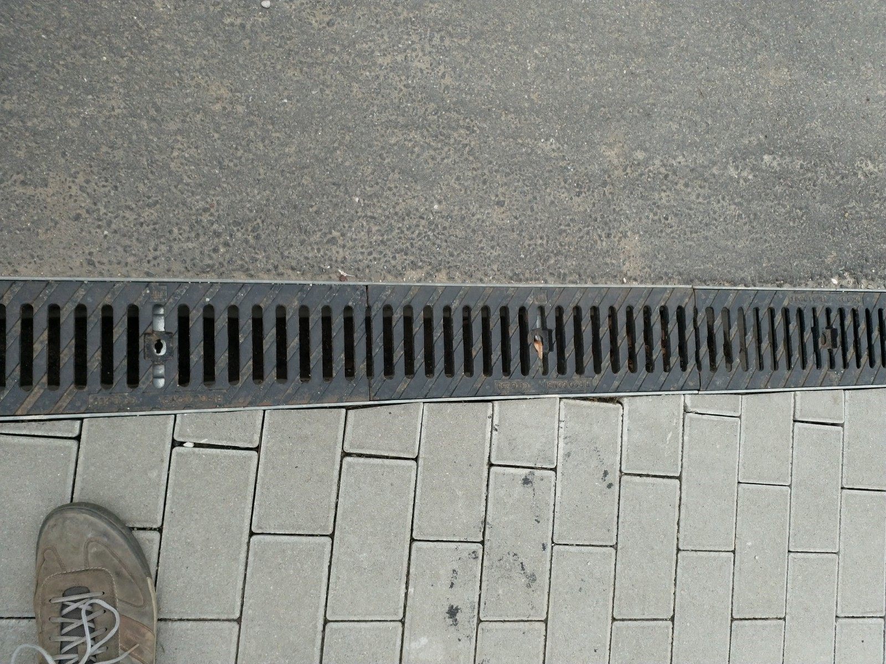

# K &ndash; Sicherungen für Ablaufgitter fehlen

_[&lt; zurück](../../index.md)_



## Ursprünglicher Meldungstext

> Status: Neu (Nach Abnahme); erledigt\
> Raum: Tiefgarageneinfahrt\
> Beschreibung: Sicherungen für Ablaufgitter fehlen.\
> Frist: 31.03.2021

## Weitere Historie

[Bauträger EMail (14.07.2024)]:

> Punkt K: Rinnenverschrauben wird angebracht - Dieser Punkt wurde erledigt. 

## Fotos

[Bauträger EMail (14.07.2024)]: https://drive.google.com/file/d/19hDpQ9SWxaemkfX0wXpxzCk9p0P5WIK4/view?usp=drive_link
