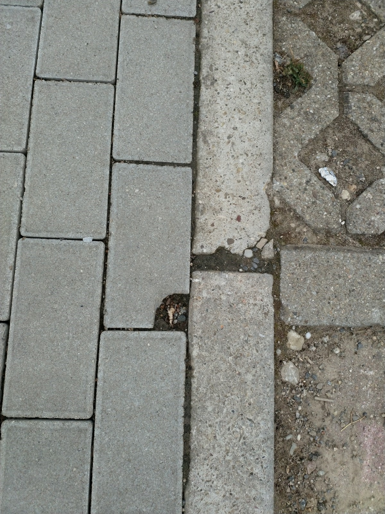

# L &ndash; Gebrochener/angeschnittener Pflasterstein verwendet

_[&lt; zurück](../../index.md)_



## Ursprünglicher Meldungstext

> Status: Neu (Nach Abnahme); kein Mangel; Vermessungspunkt\
> Raum: Tiefgarageneinfahrt\
> Beschreibung: Gebrochener/angeschnittener Pflasterstein verwendet.\
> -> Ist Vermessungspunkt!
> Frist: 31.03.2021

