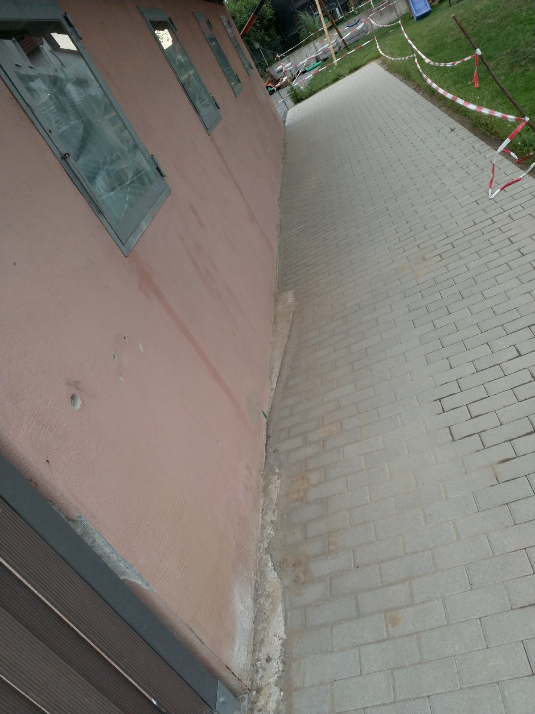

# X &ndash; Schuppen vom Nachbar Im Sockelbereich ohne Beton. Mit Schutzfolie ausstatten.

_[&lt; zurück](../../index.md)_



## Ursprünglicher Meldungstext

> Status: Im Abnahmeprotokoll; nicht erledigt trotz mehrmaliger Aufforderung.\
> Raum: Privatweg südlich Tiefgarage\
> Beschreibung: Schuppen vom Nachbar Im Sockelbereich ohne Beton. Mit Schutzfolie ausstatten.\
> Frist: 31.03.2021

## Historie

[Bauträger EMail (14.07.2024)]:

> Punkt X: Bauträger prüft, ob Handlungsbedarf besteht – Dieser Punkt wurde geprüft und mit der Rechtsabteilung besprochen. Es besteht kein Handlungsbedarf. Am Bestandsgebäude wurde nichts verändert, und die gepflasterte Stelle stellt keine Gefahr für den Schuppen des Nachbarn dar. Der Schuppen ist sehr alt und hätte bereits Schaden genommen, wenn ein Mangel bestehen würde. Dies kann jedoch ausgeschlossen werden.

## Fotos

[Bauträger EMail (14.07.2024)]: https://drive.google.com/file/d/19hDpQ9SWxaemkfX0wXpxzCk9p0P5WIK4/view?usp=drive_link
