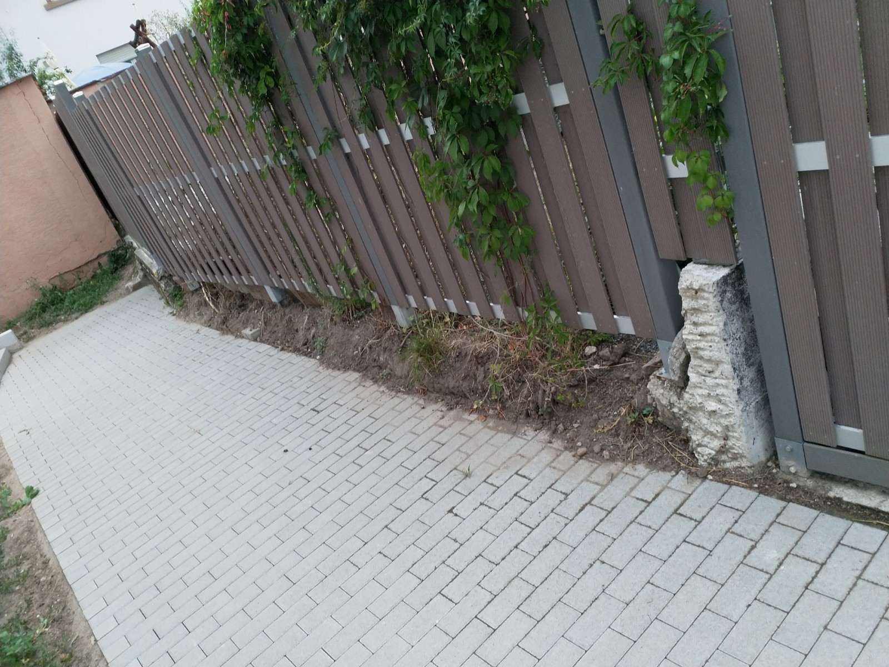

# Y &ndash; Erde von Nachbargrundstück rutscht auf Privatweg der WEG wegen mangelnder Seitenbefestigung Fußweg

_[&lt; zurück](../../index.md)_



## Ursprünglicher Meldungstext

> Status: Hinfällig. Nachbar hat Mauer gesetzt.\
> Raum: Privatweg südlich von Tiefgarage\
> Beschreibung: Erde von Nachbargrundstück rutscht auf Privatweg der WEG wegen mangelnder Seitenbefestigung Fußweg.\
> Frist: 31.03.2021

## Fotos

