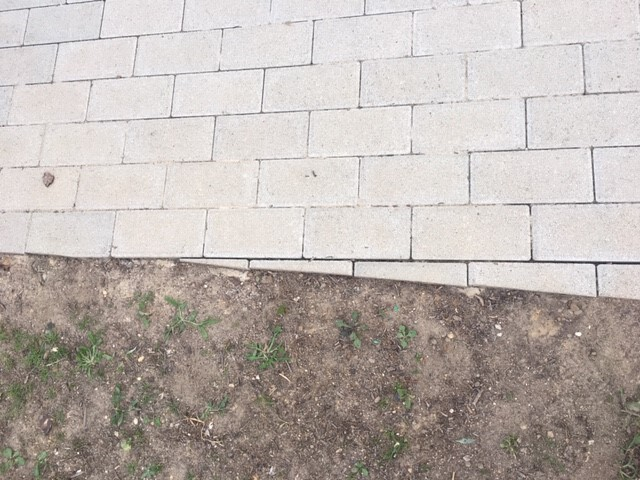
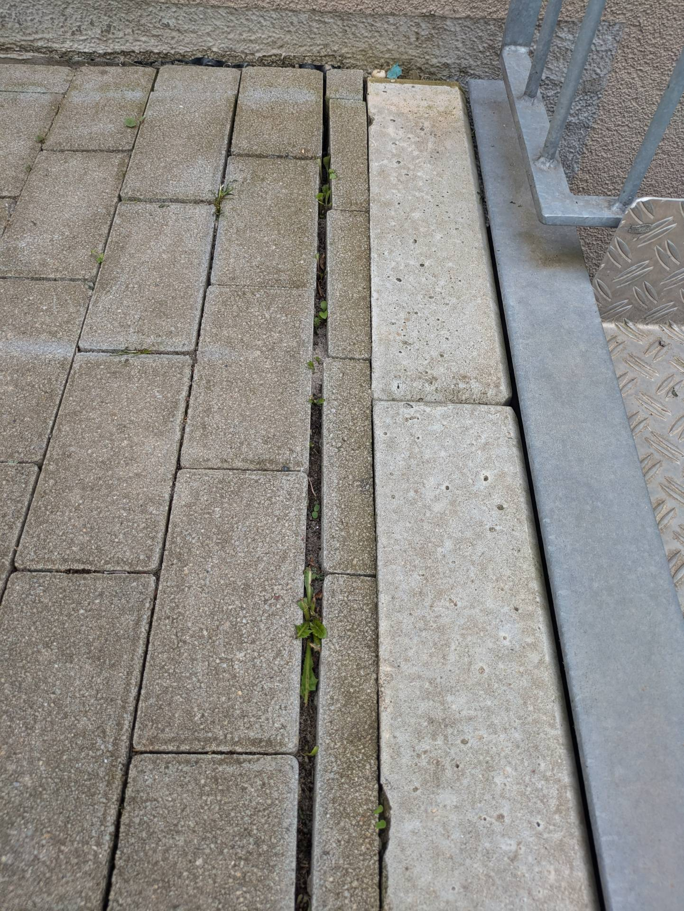
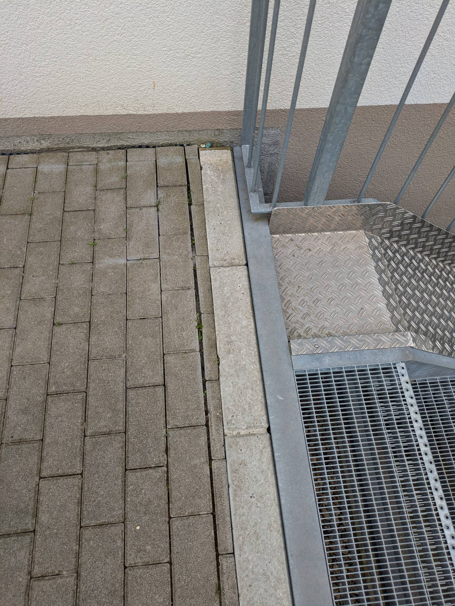

# Z &ndash; Mangelhafte Pflasterarbeiten. Pfützenbildung (keine Gefälle). Mangelhafte Fugenbreiten. Mangelhafte Pflasterabschlüsse

_[&lt; zurück](../../index.md)_



## Ursprünglicher Meldungstext

> Status: Neu (Nach Abnahme), unbearbeitet\
> Raum: Pflasterwege gesamte WEG\
> Beschreibung: Mangelhafte Pflasterarbeiten. Pfützenbildung (keine Gefälle). Mangelhafte Fugenbreiten. Mangelhafte Pflasterabschlüsse\
> -> Achtung: Auf TG-Dach könnten Pflasterungen ohne Gefälle in Ordnung sein, da andere Entwässerungstechnik? (durch Fugen Pflastersteine und darunter liegende Schüttung auf Betondach)\
> Frist: 31.03.2021

## Historie

EMail 27.09.2023 an Bauträger:

> Punkt Z ist sehr knapp gefasst. Hierzu hatte ich mir folgende Notizen gemacht:
>  - Ausbesserung Pflastersteine an den Gärten Haus 8-13, da diese in die Gärten rutschen, bzw. zukünftig rutschen könnten
>  - Ausbesserung Pflastersteine am Abgang des Weges zur Wendeplattform, da sich hier einige Steine gehoben haben und Stolperfallen bilden
>  - bei Regen Prüfung durch Bauträger, an welchen Stellen sich starke Pfützen bilden und Ausbesserung dieser Stellen. 

[Bauträger EMail (14.07.2024)]:

> Punkt Z: Stellen, die Absenkungen aufweisen, werden partiell nachgearbeitet – Der Außenanlagenbauer war vor Ort und hat keine Auffälligkeiten festgestellt. Am 23. Mai 2024 war ich mit einem weiteren Außenanlagenbauer vor Ort, der sich die Stellen ebenfalls angeschaut hat. Ob Handlungsbedarf besteht, muss noch geklärt werden. Besonders bei Regenereignissen wollte der Außenanlagenbauer die Situation vor Ort überprüfen, um die ggf. notwendigen Arbeiten besser einschätzen zu können.

## Fotos

2024-06-28

2024-06-28

[Bauträger EMail (14.07.2024)]: https://drive.google.com/file/d/19hDpQ9SWxaemkfX0wXpxzCk9p0P5WIK4/view?usp=drive_link
